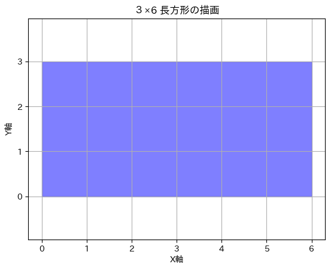
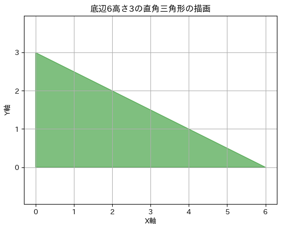
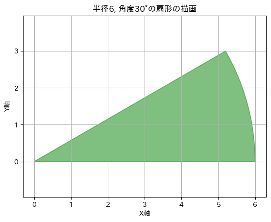
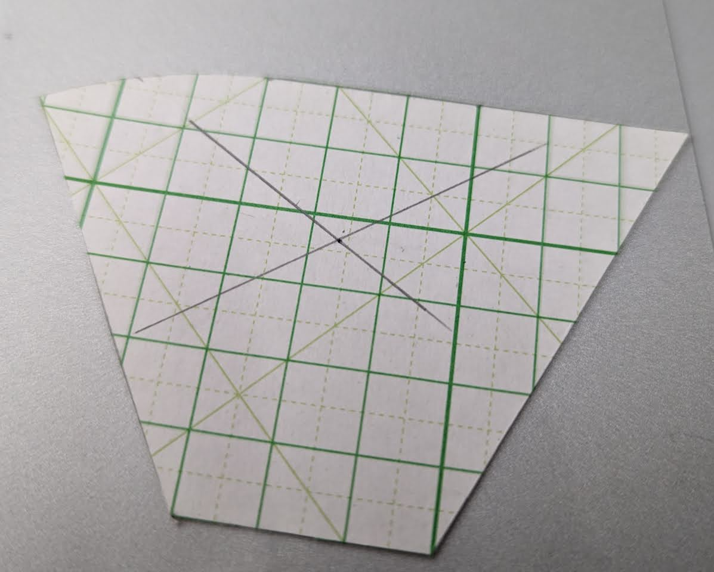
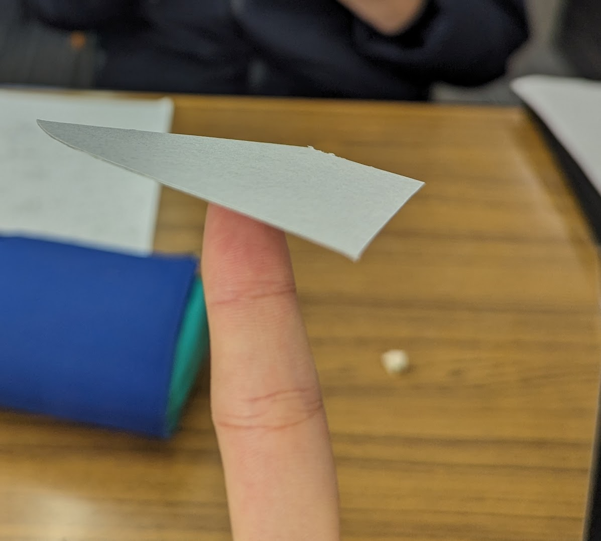
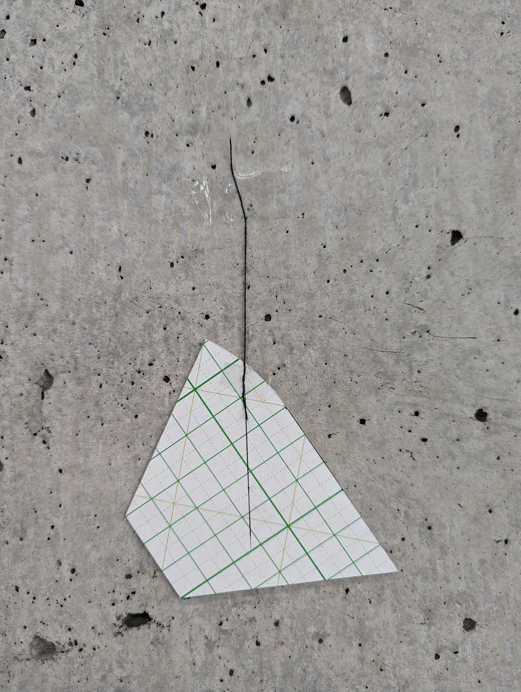

\clearpage
# 概要
今回は，扇形と長方形と三角形が結合した図形の重心を求める．

# 理論
## 長方形の重心

{#fig:tyou width=70%}

[@fig:tyou]のように$4\times6$の長方形の重心を求める

\begin{align*}
C\text{：}0 \leqq x \leqq 2, 0 \leqq y \leqq 3 \\
d V = d x d y\\
V_c=3\times6=18
\end{align*}

とする．

\begin{align*}
x_g
&=\frac{1}{V_c}\int_{C}xdV\\
&=\frac{1}{V_c}\int_{0}^{6}\int_{0}^{3}xdydx\\
&=\frac{1}{V_c}\int_{0}^{6}x(3)dx\\
&=\frac{1}{V_c}3\frac{1}{2}x^2\Big|_{0}^{6}\\
&=\frac{1}{V_c}3\frac{1}{2}\times6^2\\
&=\frac{1}{V_c}54\\
&=3
\end{align*}

\begin{align*}
y_g
&=\frac{1}{V_c}\int_{C}ydV\\
&=\frac{1}{V_c}\int_{0}^{3}\int_{0}^{6}ydydx\\
&=\frac{1}{V_c}\int_{0}^{3}y(6)dy\\
&=\frac{1}{V_c}6\frac{1}{2}y^2\Big|_{0}^{3}\\
&=\frac{1}{V_c}6\frac{1}{2}\times3^2\\
&=\frac{1}{V_c}27\\
&=1.5
\end{align*}

## 三角形の重心

{#fig:san width=70%}

[@fig:san]のように$(0,0),(6,0),(0,3)$の頂点で構成される直角三角形の重心を求める．

\begin{align*}
C\text{：}0 \leqq x \leqq 6, 0 \leqq y \leqq 3-\frac{x}{2} \\
d V = d x d y\\
V_c=\frac{1}{2}\times6\times3=9
\end{align*}

とする．

\begin{align*}
x_g
&=\frac{1}{V_c}\int_{C}xdV\\
&=\frac{1}{V_c}\int_{0}^{6}\int_{0}^{3-\frac{x}{2}}xdydx\\
&=\frac{1}{V_c}\int_{0}^{6}x(3-\frac{x}{2})dx\\
&=\frac{1}{V_c}(\frac{9}{2}x-\frac{1}{6}x^3)\Big|_{0}^{6}\\
&=\frac{1}{V_c}(\frac{9}{2}\times6-\frac{1}{6}\times6^3)\\
&=\frac{1}{V_c}\times18\\
&=2
\end{align*}

\begin{align*}
y_g
&=\frac{1}{V_c}\int_{C}ydV\\
&=\frac{1}{V_c}\int_{0}^{6}\int_{0}^{3-\frac{x}{2}}ydydx\\
&=\frac{1}{V_c}\int_{0}^{6}\frac{1}{2}y^2\Big|_{6}^{3-\frac{x}{2}}dx\\
&=\frac{1}{V_c}\int_{0}^{6}\frac{1}{2}((3-\frac{x}{2})^2-6^2)dx\\
&=\frac{1}{V_c}\int_{0}^{6}\frac{x^2-12x+36}{8}dx\\
&=\frac{1}{V_c}(\frac{1}{24}x^3-3x^2+18x)\Big|_{0}^{6}\\
&=\frac{1}{V_c}(\frac{1}{24}\times6^3-3\times6^2+18\times6)\\
&=\frac{1}{V_c}\times9\\
&=1
\end{align*}

## 扇形の重心

{#fig:ougi width=70%}

[@fig:ougi]のように半径6, 角度30°の扇形の重心を求める．

\begin{align*}
C\text{：}0 \leqq r \leqq 6, 0 \leqq \theta \leqq \frac{\pi}{6} \\
d V = r dr d\theta\\
V_c=6^2 \pi \frac{1}{12}=3\pi\\
\begin{cases}
x=r\cos\theta\\
y=r\sin\theta
\end{cases}
\end{align*}

\begin{align*}
x_g
&=\frac{1}{V_c}\int_{C}xdV\\
&=\frac{1}{V_c}\int_{0}^{\frac{\pi}{6}}\int_{0}^{6}r\cos\theta r dr d\theta\\
&=\frac{1}{V_c}\int_{0}^{\frac{\pi}{6}}\cos\theta\int_{0}^{6}r^2 dr d\theta\\
&=\frac{1}{V_c}\int_{0}^{\frac{\pi}{6}}\cos\theta\frac{1}{3}r^3\Big|_{0}^{6} d\theta\\
&=\frac{1}{V_c}\int_{0}^{\frac{\pi}{6}}\cos\theta\times72 d\theta\\
&=\frac{1}{V_c}72\sin\theta\Big|_{0}^{\frac{\pi}{6}}\\
&=\frac{1}{V_c}72\sin\frac{\pi}{6}\\
&=\frac{1}{V_c}72\times\frac{1}{2}\\
&=\frac{12}{\pi}\\
&=\simeq 3.82
\end{align*}

\begin{align*}
y_g
&=\frac{1}{V_c}\int_{C}ydV\\
&=\frac{1}{V_c}\int_{0}^{\frac{\pi}{6}}\int_{0}^{6}r\sin\theta r dr d\theta\\
&=\frac{1}{V_c}\int_{0}^{\frac{\pi}{6}}\sin\theta\int_{0}^{6}r^2 dr d\theta\\
&=\frac{1}{V_c}\int_{0}^{\frac{\pi}{6}}\sin\theta\frac{1}{3}r^3\Big|_{0}^{6} d\theta\\
&=\frac{1}{V_c}\int_{0}^{\frac{\pi}{6}}\sin\theta\times72 d\theta\\
&=\frac{1}{V_c}72(-\cos\theta)\Big|_{0}^{\frac{\pi}{6}}\\
&=\frac{1}{V_c}72(-\cos\frac{\pi}{6}+1)\\
&=\frac{1}{V_c}72\times\frac{\sqrt{3}}{2}\\
&=\frac{1}{3\pi}(72-36\sqrt{3})\\
&=\frac{24-12\sqrt{3}}{\pi}\\
&=\simeq 1.02
\end{align*}

## 全体の重心

上から，扇形，長方形，三角形の順につなげる．
左下を原点にして，$x$軸を右向き，$y$軸を上向きとする．
すると三角形の重心は$(4,2)$，長方形の重心は$(3,1.5)$，扇形の重心は$(3.82,5.02)$となる．

全体の重心を$(total_x, total_y)$とすると，

\begin{align*}
total_x=\frac{1}{3}(4+3+3.82)=3.61\\
total_y=\frac{1}{3}(2+4.5+7.02)=4.51
\end{align*}

となる．

# 実験
理論の章で求めた通り，全体の重心は$(3.61,4.51)$となった．この情報をもとに[@fig:work]のように工作用紙を切り抜き，重心で支えてみた．

{#fig:work width=70%}

# 結果

当初は，シャーペンの先端で支えようとしたが，支えることが出来なかった．シャーペンではなく，指先で支えようとしたところ，[@fig:work2]のように支えることが出来た．

{#fig:work2 width=70%}

また，[@fig:work3]のように任意の２点で吊り下げたとき，重心がそこから鉛直線上にあることを確認した．

{#fig:work3 width=70%}

# 考察

結果から今回の実験は成功したと言える．
計算通りの点に重心があることを確認できた．しかし，シャーペンの先端のような細いものでは支えることが出来なかった．これは，工作用紙の精度が悪く，重心が計算通りの位置にあるとしても，その位置から少しズレた位置に重心があると考えられる．

任意の２点で吊り下げたとき，2つの作用線の交点に重心があることを確認できた．これは，重心が計算通りの位置にあることを示している．重心が計算ではなく，紐で吊るすだけで求められるため直感的にも重心を確認できた．

# 感想

今回の実験で，計算通りの重心があることを確認できた．特に任意の２点で吊り下げたとき，2つの作用線の交点に重心があることを確認できたことは，重心の求め方を理解する上で大きな助けとなった．
<!-- 
私は，重心を求めるのは，力学の源と思っています．そのルーツを木村先生と一緒に考え共有したいと思って授業に参加しています．人間にとって，力学とは，どうゆう存在であるかを考えるためです．毎授業新たな気づきがあり，今回の授業も私にとって大変刺激的です．今回の課題は，私達からのメッセージです．双方向的なエネルギーの交換なのです． -->