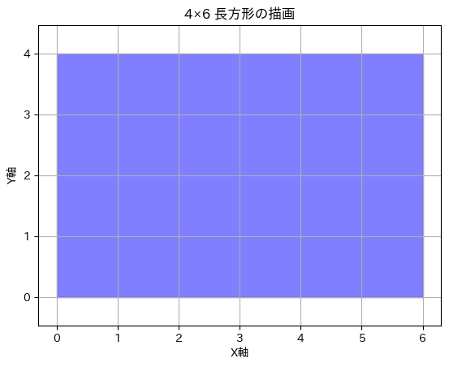

# 概要
今回は，扇形と長方形と三角形が結合した図形の重心を求める．

# 重心
## 長方形の重心

{#fig:tyou width=70%}

[@fig:tyou]のように$4\times6$の長方形の重心を求める

$$
\begin{align*}
C\text{：}0 \leqq x \leqq 2, 0 \leqq y \leqq 4 \\
d V = d x d y\\
V_c=4\times6=24
\end{align*}
$$
とする．

$$
\begin{align*}
x_g
&=\frac{1}{V_c}\int_{C}xdV\\
&=\frac{1}{V_c}\int_{0}^{6}\int_{0}^{4}xdydx\\
&=\frac{1}{V_c}\int_{0}^{6}x(4)dx\\
&=\frac{1}{V_c}4\frac{1}{2}x^2\Big|_{0}^{6}\\
&=\frac{1}{V_c}4\frac{1}{2}\times6^2\\
&=\frac{1}{V_c}72\\
&=3
\end{align*}
$$

$$
\begin{align*}
y_g
&=\frac{1}{V_c}\int_{C}ydV\\
&=\frac{1}{V_c}\int_{0}^{4}\int_{0}^{6}ydydx\\
&=\frac{1}{V_c}\int_{0}^{4}y(6)dy\\
&=\frac{1}{V_c}6\frac{1}{2}y^2\Big|_{0}^{4}\\
&=\frac{1}{V_c}6\frac{1}{2}\times4^2\\
&=\frac{1}{V_c}48\\
&=2
\end{align*}
$$

## 三角形の重心

{#fig:san width=70%}

[@fig:san]のように$(0,0),(6,0),(0,3)$の頂点で構成される直角三角形の重心を求める．

$$
\begin{align*}
C\text{：}0 \leqq x \leqq 6, 0 \leqq y \leqq 3-\frac{x}{2} \\
d V = d x d y\\
V_c=\frac{1}{2}\times6\times3=9
\end{align*}
$$
とする．

$$
\begin{align*}
x_g
&=\frac{1}{V_c}\int_{C}xdV\\
&=\frac{1}{V_c}\int_{0}^{6}\int_{0}^{3-\frac{x}{2}}xdydx\\
&=\frac{1}{V_c}\int_{0}^{6}x(3-\frac{x}{2})dx\\
&=\frac{1}{V_c}(\frac{9}{2}x-\frac{1}{6}x^3)\Big|_{0}^{6}\\
&=\frac{1}{V_c}(\frac{9}{2}\times6-\frac{1}{6}\times6^3)\\
&=\frac{1}{V_c}\times18\\
&=2
\end{align*}
$$

$$
\begin{align*}
y_g
&=\frac{1}{V_c}\int_{C}ydV\\
&=\frac{1}{V_c}\int_{0}^{6}\int_{0}^{3-\frac{x}{2}}ydydx\\
&=\frac{1}{V_c}\int_{0}^{6}\frac{1}{2}y^2\Big|_{6}^{3-\frac{x}{2}}dx\\
&=\frac{1}{V_c}\int_{0}^{6}\frac{1}{2}((3-\frac{x}{2})^2-6^2)dx\\
&=\frac{1}{V_c}\int_{0}^{6}\frac{x^2-12x+36}{8}dx\\
&=\frac{1}{V_c}(\frac{1}{24}x^3-3x^2+18x)\Big|_{0}^{6}\\
&=\frac{1}{V_c}(\frac{1}{24}\times6^3-3\times6^2+18\times6)\\
&=\frac{1}{V_c}\times9\\
&=1
\end{align*}
$$

## 扇形の重心

{#fig:ougi width=70%}

[@fig:ougi]のように半径6, 角度30°の扇形の重心を求める．

$$
\begin{align*}
C\text{：}0 \leqq r \leqq 6, 0 \leqq \theta \leqq \frac{\pi}{6} \\
d V = r dr d\theta\\
V_c=6^2 \pi \frac{1}{12}=3\pi\\
\begin{cases}
x=r\cos\theta\\
y=r\sin\theta
\end{cases}
\end{align*}
$$

$$
\begin{align*}
x_g
&=\frac{1}{V_c}\int_{C}xdV\\
&=\frac{1}{V_c}\int_{0}^{\frac{\pi}{6}}\int_{0}^{6}r\cos\theta r dr d\theta\\
&=\frac{1}{V_c}\int_{0}^{\frac{\pi}{6}}\cos\theta\int_{0}^{6}r^2 dr d\theta\\
&=\frac{1}{V_c}\int_{0}^{\frac{\pi}{6}}\cos\theta\frac{1}{3}r^3\Big|_{0}^{6} d\theta\\
&=\frac{1}{V_c}\int_{0}^{\frac{\pi}{6}}\cos\theta\times72 d\theta\\
&=\frac{1}{V_c}72\sin\theta\Big|_{0}^{\frac{\pi}{6}}\\
&=\frac{1}{V_c}72\sin\frac{\pi}{6}\\
&=\frac{1}{V_c}72\times\frac{1}{2}\\
&=\frac{12}{\pi}\\
&=\simeq 3.82
\end{align*}
$$

$$
\begin{align*}
y_g
&=\frac{1}{V_c}\int_{C}ydV\\
&=\frac{1}{V_c}\int_{0}^{\frac{\pi}{6}}\int_{0}^{6}r\sin\theta r dr d\theta\\
&=\frac{1}{V_c}\int_{0}^{\frac{\pi}{6}}\sin\theta\int_{0}^{6}r^2 dr d\theta\\
&=\frac{1}{V_c}\int_{0}^{\frac{\pi}{6}}\sin\theta\frac{1}{3}r^3\Big|_{0}^{6} d\theta\\
&=\frac{1}{V_c}\int_{0}^{\frac{\pi}{6}}\sin\theta\times72 d\theta\\
&=\frac{1}{V_c}72(-\cos\theta)\Big|_{0}^{\frac{\pi}{6}}\\
&=\frac{1}{V_c}72(-\cos\frac{\pi}{6}+1)\\
&=\frac{1}{V_c}72\times\frac{\sqrt{3}}{2}\\
&=\frac{1}{3\pi}(72-36\sqrt{3})\\
&=\frac{24-12\sqrt{3}}{\pi}\\
&=\simeq 1.02
\end{align*}
$$

