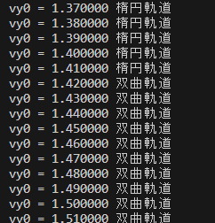
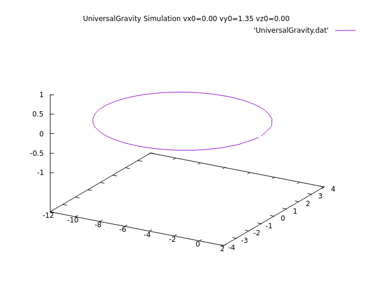
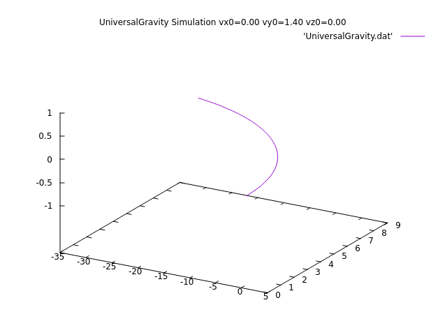
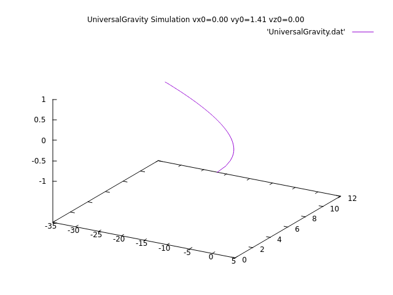
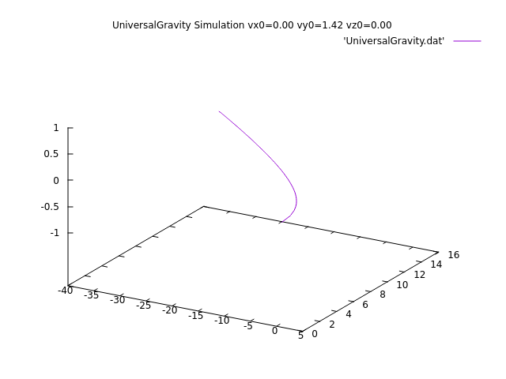
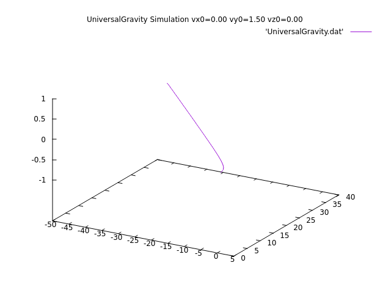
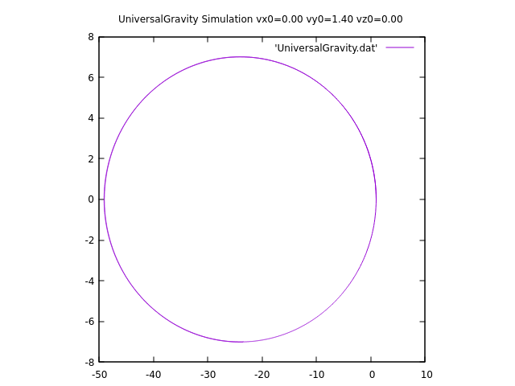

 <script type="text/javascript" async src="https://cdnjs.cloudflare.com/ajax/libs/mathjax/2.7.7/MathJax.js?config=TeX-MML-AM_CHTML">
</script>
<script type="text/x-mathjax-config">
 MathJax.Hub.Config({
 tex2jax: {
 inlineMath: [['$', '$'] ],
 displayMath: [ ['$$','$$'], ["\\[","\\]"] ]
 }
 });
</script>

# 情報処理演習Ⅱ 個人課題3-2 レポート <br> ~万有引力型シミュレーション~

<div style="text-align: right">

#  BQ23107 窪田大輝  <br> 
</div>

## 概要
万有引力を用いたシミュレーションを行うプログラムを作成．
このC言語のプログラムは，宇宙物体の運動をシミュレーションするものである．具体的には，万有引力による運動を模擬した．以下に，プログラムの概要をまとめる．

## 仮説
図1のような軌道判定のプログラムを実行し，エネルギー保存則より楕円軌道をとるのか，放物軌道をとるのか，双曲軌道をとるのか確認した．

```c
/*
課題3-2
*/
#include <stdio.h>
#include <math.h>
#ifndef M_PI
#define M_PI 3.14159265358979323846
#endif

double r(double x, double y, double z){
    return sqrt(x*x+y*y+z*z);
}

double v(double vx0, double vy0, double vz0){
    return sqrt(vx0*vx0+vy0*vy0+vz0*vz0);

}

int main(void){
    double k,M,m,x,y,z,vx,vy,vz,x0,y0,z0,vx0,vy0,vz0,t0,t1,t,ax,ay,az,xx,yy,zz,dt,ddt,KE;
    int i,nump,numpp;
    
    k = 1.0; //係数を1.0とする(万有引力定数)
    M = 1.0; //中心物体の質量を1.0とする
    m = 1.0; //回転物体の質量を1.0とする

    //---------------------------------//
    x0 = 1.0; //初期位置x0を1.0とする
    y0 = 0.0; //初期位置y0を0.0とする
    z0 = 0.0; //初期位置z0を0.1とする

    vx0 = 0.0; //初速度vx0を0.0とする
    vy0 = 1.0; //初速度vy0を1.0とする
    vz0 = 0.0; //初速度vz0を0.0とする

    x = x0; //初期位置xをx0とする
    y = y0; //初期位置yをy0とする
    z = z0; //初期位置zをz0とする

    vx = vx0; //初速度vxをvx0とする
    vy = vy0; //初速度vyをvy0とする
    vz = vz0; //初速度vzをvz0とする
    //---------------------------------//


    for(int i=100; i<200; i++){
        vy0 = i*0.01;
        KE = m*pow(v(vx0, vy0, vz0), 2)/2-k/r(x0, y0, z0);

        if(KE<0){
            printf("vy0 = %f ", vy0);
            printf("楕円軌道\n");
        } else if(KE=0){
            printf("vy0 = %f ", vy0);
            printf("放物軌道\n");
        } else {
            printf("vy0 = %f ", vy0);
            printf("双曲軌道\n");
        }
    }
}

```
<center>図1 軌道判定プログラム</center><br>

図2は図1のプログラムの実行結果である．図2より，$vy0≦1.41$のときに楕円軌道を描き，$vy0>1.42$のときに放物軌道を描くことがわかる．

<center></center><br>
<center>図2 軌道判定プログラムの実行結果</center><br>


## 検証


### 作成したプログラムの説明
1. **関数定義:**
   - `r`: 3次元座標 (x, y, z) の原点からの距離を計算する関数．

2. **main 関数:**
   - 変数の宣言と初期化: 係数 `k`，中心物体の質量 `M`，回転物体の質量 `m` など，初期条件や物体の性質を設定．
   - 初期位置 `(x0, y0, z0)` および初速度 `(vx0, vy0, vz0)` を設定．
   - ファイルポインタ `gp` と `fp` を用意して，gnuplot およびデータファイルへの書き込みを行う．

3. **シミュレーション:**
   - 時間の初期値 `t0` から終了時刻 `t1` までのシミュレーションを実施．
   - `nump` 回のイテレーションを行い，各ステップごとに座標 `(x, y, z)` を更新．
   - プロットする点の数を100個に限定するために，更新された座標をデータファイルに書き込み．

4. **gnuplot での描画:**
   - gnuplot を用いて，データファイルの内容を3Dプロットして表示．


5. **結果の表示:**
   - gnuplot で描画された結果は，UniversalGravity.dat ファイルに保存する．

### 実際に作成したプログラム
 図3は前述した説明に基づいた 万有引力型シミュレーションプログラムである．
```c
/*
課題3-2
*/
#include <stdio.h>
#include <math.h>
#ifndef M_PI
#define M_PI 3.14159265358979323846
#endif

double r(double x, double y, double z){
    return sqrt(x*x+y*y+z*z);
}


int main(void){
    double k,M,m,x,y,z,vx,vy,vz,x0,y0,z0,vx0,vy0,vz0,t0,t1,t,ax,ay,az,xx,yy,zz,dt,ddt,KE;
    int i,nump,numpp;
    
    k = 1.0; //係数を1.0とする(万有引力定数)
    M = 1.0; //中心物体の質量を1.0とする
    m = 1.0; //回転物体の質量を1.0とする

    //---------------------------------//
    x0 = 1.0; //初期位置x0を1.0とする
    y0 = 0.0; //初期位置y0を0.0とする
    z0 = 0.0; //初期位置z0を0.1とする

    vx0 = 0.0; //初速度vx0を0.0とする
    vy0 = 1.40; //初速度vy0を1.0とする
    vz0 = 0.0; //初速度vz0を0.0とする

    x = x0; //初期位置xをx0とする
    y = y0; //初期位置yをy0とする
    z = z0; //初期位置zをz0とする

    vx = vx0; //初速度vxをvx0とする
    vy = vy0; //初速度vyをvy0とする
    vz = vz0; //初速度vzをvz0とする
    //---------------------------------//

    //---------------------------------//
    FILE *gp;
    gp = popen("gnuplot --persist -slow", "w"); 
    //popen は "process open" の略で、子プロセスを開くことを目的
    //FILE *popen(const char *command, const char *mode);

    FILE *fp;
    fp = fopen("UniversalGravity.dat", "w");
    //---------------------------------//


    t0 = 0.0; //初期時刻t0を0.0とする
    t1 = 1500; //終了時刻t1とする

    nump = 10000; //分割数を10000とする
    dt = (t1-t0)/nump; //時間刻み幅dtを計算する

    numpp = 100; //分割数100とする(dataファイルへの出力用)
    ddt = (t1-t0)/numpp; //時間刻み幅ddtを計算する

    for(int i=0; i<nump; i++){
        if(i%numpp==0){
            printf("%f %f %f\n",x,y,z);
            fprintf(fp, "%f %f %f\n", x,y,z);
        }
        xx=x; 
        yy=y; 
        zz=z; 
        x=x+vx*dt; //x座標を設定
        y=y+vy*dt; //y座標を設定
        z=z+vz*dt; //z座標を設定
        vx=vx+dt*m*M*(-k*xx/pow(r(xx,yy,zz),3))/m; //質量にmとMを設定
        vy=vy+dt*m*M*(-k*yy/pow(r(xx,yy,zz),3))/m;
        vz=vz+dt*m*M*(-k*zz/pow(r(xx,yy,zz),3))/m;
    }
    fclose(fp);

    fprintf(gp, "splot 'UniversalGravity.dat' w l \n");
    fprintf(gp, "set title \"UniversalGravity Simulation vx0=%.2f vy0=%.2f vz0=%.2f\"\n", vx0, vy0, vz0);
    fprintf(gp, "set size square\n");
    fprintf(gp, "replot \n");
    fflush(gp);
    pclose(gp);

    return 0;

}

```
<center>図3 万有引力型シミュレーションプログラム</center><br>

### 実行結果
図4,5,6,7,8は図3のプログラムの実行結果である．図4より，万有引力による運動をシミュレーションできていることがわかり，楕円軌道になっている．しかし，図5,6,7,8は楕円軌道になっていないことがわかる


<center></center>
<center>図4 vy0 = 1.35のときの実行結果</center><br>

<center></center>
<center>図5 vy0 = 1.4のときの実行結果</center><br>

<center></center>
<center>図6 vy0 = 1.41のときの実行結果</center><br>

<center></center>
<center>図7 vy0 = 1.42のときの実行結果</center><br>

<center></center>
<center>図8 vy0 = 1.5のときの実行結果</center><br>

## 考察
検証の章で述べた通り，運動エネルギー保存則より，軌道が$vy_0=1.41/1.42$を境に楕円軌道と放物軌道に分かれると考えられる．しかし，図5の$vy_0=1.4$時点で楕円軌道になっていないことがわかる．これは，オイラー法の精度不足に起因するものだと考えられる．描画時間を伸ばしととしても，楕円軌道になるそうもない．しかし，図9のように精度を1000倍にすると，楕円軌道になることがわかる．

<center></center>
<center>図9 vy0 = 1.4のときの実行結果(精度を1000倍にした)</center><br>

よって，オイラー法の精度不足により，楕円軌道にならないことがわかった．そのため，小数点第二位まで検証する必要があるときには，1/10000程度の精度では精度不足となり，オイラー法の精度を上げる必要があるといえる．また，オイラー法以外のより精度の高い方法を用いることで，より正確なシミュレーションを行うべきだ．