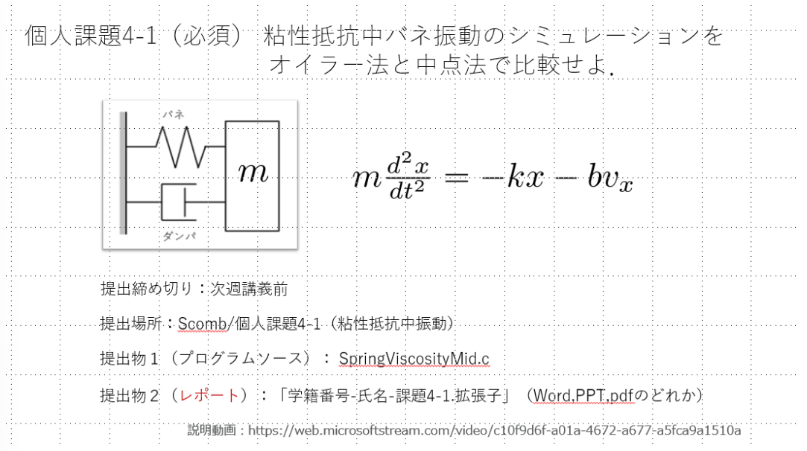
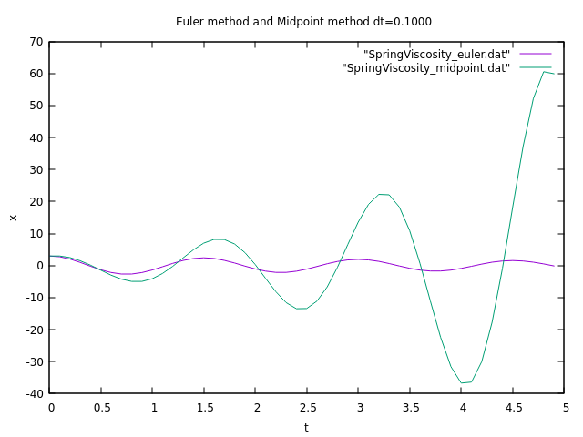
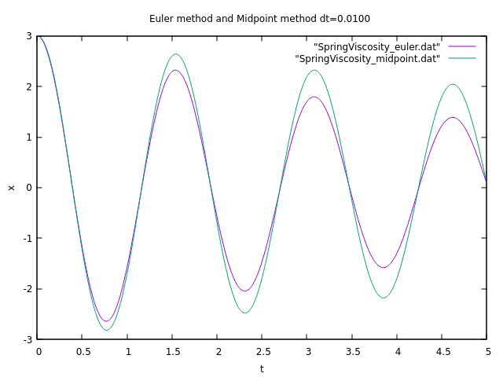
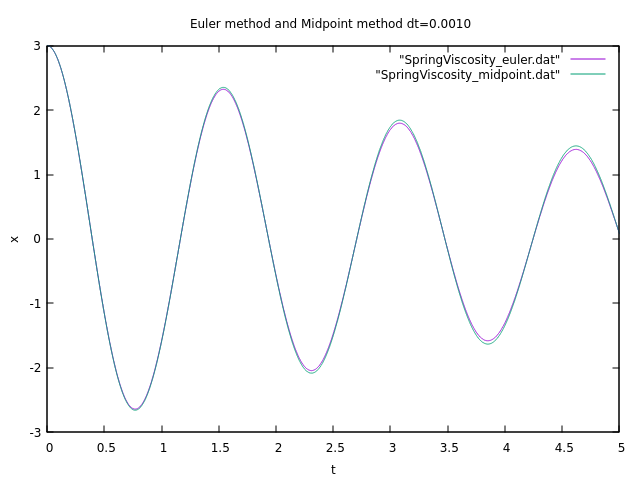
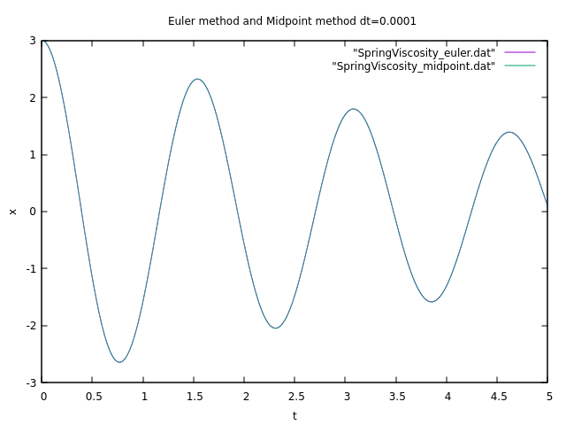

# 情報処理演習Ⅱ（課題4-1） BQ23107 窪田大輝

## 目的
粘性抵抗中のバネ振動のシミュレーションをオイラー法と中点法で比較せよ．

## 結果(作成したプログラム)
### 講義動画で作成したプログラム
図1は講義動画で作成したSpringViscosityMid.cファイルである．このプログラムは，粘性抵抗中のバネ振動のシミュレーションを中点法で行っている．

@import "SpringViscosityMid.c"

Fig.1 講義動画で作成したSpringViscosityMid.cのプログラム

### オイラー法と中点法を比較したプログラム
オイラー法と中点法を比較するためのプログラムを作成した．その上でGnuplotでグラフを描画した．今回はプログラム上でdatファイルを生成するようにし，Gnuplotでグラフ描画も行った．

@import "SpringViscosity_compare.c"

Fig.2 オイラー法と中点法を比較したプログラム
 
図2はオイラー法と中点法を比較したプログラムである．このプログラムは，粘性抵抗中のバネ振動
のシミュレーションをオイラー法と中点法で行っている．

### プログラムの実行結果

Fig.3 dt=0.1の時のオイラー法と中点法の比較

図3は$dt=0.1$の時のオイラー法と中点法の比較である．粘性抵抗中のバネ振動であるため，減衰しなければならない．しかし，オイラー法では減衰すらせずに増幅している．一方，中点法では減衰している．

Fig.4 dt=0.01の時のオイラー法と中点法の比較
 

図4は$dt=0.01$の時のオイラー法と中点法の比較である．$dt=0.1$の時とは異なり，オイラー法でも，中点法でも減衰している．しかし，オイラー法では中点法と比べて，明らかに誤差が蓄積している．

Fig.5 dt=0.001の時のオイラー法と中点法の比較
 

|時刻t|オイラー法|中点法|差(中点法-オイラー法)|
|---|---|---|---|
|4.621000 | 1.388795 | 1.443330 | 0.054535 |
|4.999000 | 0.091040 | 0.090518 | -0.000522 |

Table 1 dt=0.001の時の時刻tのオイラー法と中点法の比較
 

図5は$dt=0.001$の時のオイラー法と中点法の比較である．$dt=0.01$の時と比べて，オイラー法と中点法の差が小さくなっている．定性的に評価するためにdatファイルを参照する．表1のように$t=4.621000$の時にはオイラー法と中点法の差が$0.054535$である．また，$t=4.999000$の時にはオイラー法と中点法の差が$-0.000522$である．

Fig.6 dt=0.0001の時のオイラー法と中点法の比較
 

|時刻t|オイラー法|中点法|差(中点法-オイラー法)|
|---|---|---|---|
| 4.621000 | 1.388800| 1.394159| 0.005359|
|4.999900 | 0.086320| 0.086237| -0.000083|

Table 2 dt=0.0001の時の時刻tのオイラー法と中点法の比較
 

図6は$dt=0.0001$の時のオイラー法と中点法の比較である．$dt=0.001$の時と比べて，オイラー法と中点法の差が小さくなっている．定性的に評価するためにdatファイルを参照する．表2のように$t=4.621000$の時にはオイラー法と中点法の差が$0.005359$である．また，$t=4.999900$の時にはオイラー法と中点法の差が$-0.000083$である．

## 考察

Gnuplotで描画した結果と生成されたdatファイルを踏まえて考察を行う．
$dt=0.01$である図3では明らかに近似として使えない．

|時刻t|刻み幅dt|オイラー法|中点法|差(中点法-オイラー法)|
|---|---|---|---|---|
|4.621000 |0.001| 1.388795 | 1.443330 | 0.054535 |
| 4.621000 |0.0001| 1.388800| 1.394159| 0.005359|
|4.999000 |0.001| 0.091040 | 0.090518 | -0.000522 |
|4.999900 |0.0001| 0.086320| 0.086237| -0.000083|

Table 3 dt=0.0001の時の時刻tのオイラー法と中点法の比較
 

表3はオイラー法と中点法の比較をまとめた表である．$dt=0.001$の時と比べて，$dt=0.0001$の時の方がオイラー法と中点法の差が小さくなっている．$dt=0.0001$は$t=5$の時点で最大でも誤差が$1/100$以下になっている．
しかし，オイラー法であっても中点法であっても誤差は蓄積するので，自分の必要な範囲に誤差が収まるように刻み幅を決める必要がある．無駄に細かくても実行に時間もメモリも使うため，適切な刻み幅を決める必要がある．特に時刻$t$が増加すると誤差が大きくなるため，$t$が大きくなるような場合は刻み幅を小さくしなければならない．