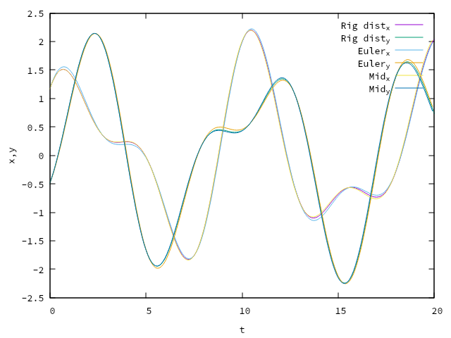
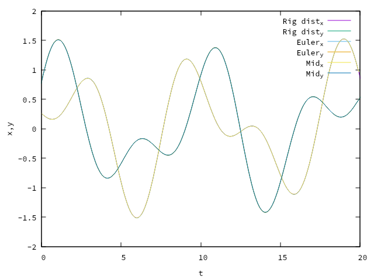
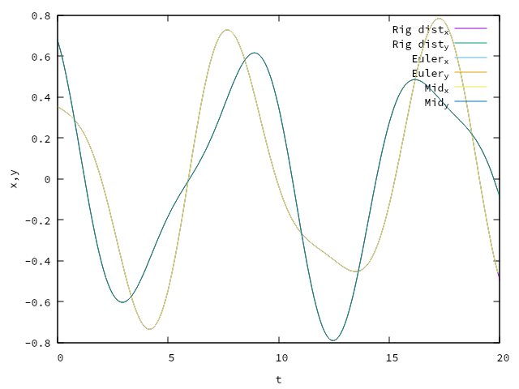
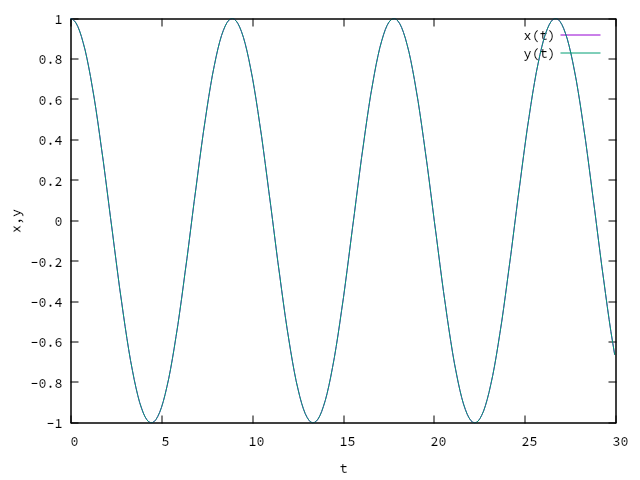
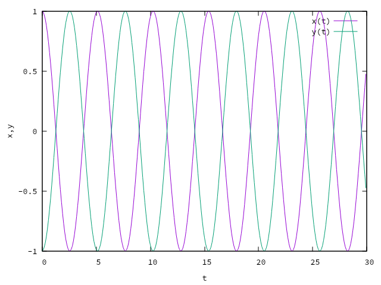

\newpage

# 概要

二自由度連成振動のシミュレーションを行う.

1. 時間刻み幅$\Delta t$を変化させ，厳密解，オイラー法，中点法を比較する．

2. 1.で得られた結果をもとに，十分に小さいと判断される$\Delta t$を用いて，中点法でモード1，モード2の運動を再現する．

# 検証(時間刻み幅$\Delta t$を変化させたときの比較)

概要に従って以下のようにプログラムを用いて検証を行う。

今回は[@lst:coupled_vibration_compare.c]のプログラムを用いて検証を行う。時間刻み幅$\Delta t$を変化させ，乱数を用いて初期値を設定し，厳密解，オイラー法，中点法を用いて計算を行う。

```{.c #lst:coupled_vibration_compare.c caption="CoupledVibrationCompare.c"}
#include <stdio.h>
#include <math.h>
#include <stdlib.h>
#include <time.h>

const double k = 1; // バネ定数
const double m = 2; // 質量 kg
const double l = 3; // バネ自然長

double fx(double x, double y) {
    return -2 * k * x + k * y;
}

double fy(double x, double y) {
    return k * x - 2 * k * y;
}

int main() {
    double w0, w1, w2;
    double t0, t1, dt, ddt, t;
    double x, y, vx, vy, x0, y0, vx0, vy0;
    double C1, C2, D1, D2, phi1, phi2;
    double kx, kvx, ky, kvy;
    int numi, nump, i;

    // 乱数ジェネレータの初期化
    srand(time(NULL));

    w0 = sqrt(k / m);
    w1 = w0;
    w2 = sqrt(3) * w0;

    t0 = 0;
    t1 = 20.0;
    // 乱数を使用して初期値を設定
    x0 = 2 * (rand() / (double)RAND_MAX) - 0.5;
    y0 = 2 * (rand() / (double)RAND_MAX) - 0.5;
    vx0 = 2 * (rand() / (double)RAND_MAX) - 0.5;
    vy0 = 2 * (rand() / (double)RAND_MAX) - 0.5;

    dt = 0.001;
    numi = (t1 - t0) / dt;

    ddt = 0.1; // 0.1秒ごとの結果をプロットする
    nump = ddt / dt; //プロット回数を制限するための変数

    t = t0;
    x = x0;
    y = y0;
    vx = vx0;
    vy = vy0;

    //---ここから厳密解-------------------------------
    FILE *fp;
    fp = fopen("CoupledVibrationRig_dist.dat", "w");

    C1 = (x0 + y0) / 2;
    C2 = (x0 - y0) / 2;
    D1 = (vx0 + vy0) / (2 * w1);
    D2 = (vx0 - vy0) / (2 * w2);

    x = C1 * cos(w1 * t) + D1 * sin(w1 * t) + C2 * cos(w2 * t) + D2 * sin(w2 * t);
    y = C1 * cos(w1 * t) + D1 * sin(w1 * t) - C2 * cos(w2 * t) - D2 * sin(w2 * t);

    for (i = 0; i <= numi; i++) {
        if (i % nump == 0) {
            printf("%f %f %f\n", t, x, y);
            fprintf(fp, "%f %f %f\n", t, x, y);
        }
        t = t + dt;
        x = C1 * cos(w1 * t) + D1 * sin(w1 * t) + C2 * cos(w2 * t) + D2 * sin(w2 * t);
        y = C1 * cos(w1 * t) + D1 * sin(w1 * t) - C2 * cos(w2 * t) - D2 * sin(w2 * t);
    }
    fflush(fp);
    fclose(fp);
    //---ここまで厳密解-------------------------------

    t = t0; // tを初期値に戻す
    x = x0; // xを初期値に戻す
    y = y0; // yを初期値に戻す
    vx = vx0; // vxを初期値に戻す
    vy = vy0; // vyを初期値に戻す

    //---ここからオイラー法----------------------------
    FILE *fp1;
    fp1 = fopen("CoupledVibrationEuler.dat", "w");

    for (i = 0; i < numi; i++) {
        if (i % nump == 0) {
            printf("%f %f %f\n", t, x, y);
            fprintf(fp1, "%f %f %f\n", t, x, y);
        }
        x = x + dt * vx;
        y = y + dt * vy;
        vx = vx + dt * fx(x, y) / m;
        vy = vy + dt * fy(x, y) / m;
        t = t + dt;
    }
    fflush(fp1);
    fclose(fp1);
    //---ここまでオイラー法----------------------------

    t = t0; // tを初期値に戻す
    x = x0; // xを初期値に戻す
    y = y0; // yを初期値に戻す
    vx = vx0; // vxを初期値に戻す
    vy = vy0; // vyを初期値に戻す

    //---ここから中点法-------------------------------
    FILE *fp2;
    fp2 = fopen("CoupledVibrationMid.dat", "w");

    for (i = 0; i < numi; i++) {
        if (i % nump == 0) {
            fprintf(fp2, "%f %f %f\n", t, x, y);
            printf("%f %f %f\n", t, x, y);
        }

        kx = x + (dt / 2) * vx; //中点法を行うためにdt/2だけ進めた値でkxを仮置きする
        ky = y + (dt / 2) * vy; //中点法を行うためにdt/2だけ進めた値でkyを仮置きする
        kvx = vx + (dt / 2) * fx(x, y) / m; //中点法を行うために値をkvx仮置きする
        kvy = vy + (dt / 2) * fy(x, y) / m; //中点法を行うために値をkvy仮置きする
        x = x + dt * kvx; //仮置きされた値を用いてxを更新する
        y = y + dt * kvy; //仮置きされた値を用いてxを更新する
        vx = vx + dt * fx(kx, ky) / m; //仮置きされた値を用いてvxを更新する
        vy = vy + dt * fy(kx, ky) / m; //仮置きされた値を用いてvyを更新する
        t = t + dt;
    }

    fflush(fp2);
    fclose(fp2);
    //---ここまで中点法-------------------------------

    FILE *gp;
    gp = popen("gnuplot -persist -slow", "w");

    // Gnuplotに送るコマンドを定義
    char *gnuplotscript =
        "set xlabel \"t\"\n"
        "set ylabel \"x,y\"\n"
        "plot "
        "\"CoupledVibrationRig_dist.dat\" u 1:2 w l title \"Rig dist_x\", "
        "\"CoupledVibrationRig_dist.dat\" u 1:3 w l title \"Rig dist_y\", "
        "\"CoupledVibrationEuler.dat\" u 1:2 w l title \"Euler_x\", "
        "\"CoupledVibrationEuler.dat\" u 1:3 w l title \"Euler_y\", "
        "\"CoupledVibrationMid.dat\" u 1:2 w l title \"Mid_x\", "
        "\"CoupledVibrationMid.dat\" u 1:3 w l title \"Mid_y\"\n";

    // Gnuplotにコマンドを送る
    fprintf(gp, "%s", gnuplotscript);

    pclose(gp);

    return 0;
}

```

# 結果(時間刻み幅$\Delta t$を変化させたときの比較)
[@lst:coupled_vibration_compare.c]のプログラムを実行した結果を以下に示す。
[@fig:cvc_dt_01]，[@fig:cvc_dt_001]，[@fig:cvc_dt_0001]はそれぞれ$\Delta t=0.1$，$\Delta t=0.01$，$\Delta t=0.001$のときの結果である。

{#fig:cvc_dt_01 width=60%}

{#fig:cvc_dt_001 width=60%}

{#fig:cvc_dt_0001 width=60%}

# 考察(時間刻み幅$\Delta t$を変化させたときの比較)
[@fig:cvc_dt_01]，[@fig:cvc_dt_001]，[@fig:cvc_dt_0001]を比較すると，$\Delta t$が小さいほど誤差の小さい結果が得られていることがわかる。特に$\Delta t=0.1$の時，厳密解と比較してオイラー法の結果がズレていることがわかる．しかし，中点法はオイラーとほぼ一致していることが確認できる．
また，$\Delta t=0.01$や$\Delta t=0.001$のときは厳密解とオイラー法，中点法の結果がほぼ一致していることがわかる．
よって，$\Delta t=0.01$で十分精度が出ているとわかる．

# 検証(モード1,モード2の再現)
考察1で得られた結果をもとに，十分に小さいと判断される$\Delta t=0.01$を用いて，中点法でモード1，モード2の運動を再現する．

## モード1,2の計算

質点1の運動を$x(t)$とおき，質点2の運動を$y(t)$とおくと，運動方程式はそれぞれ以下のように表せる。

$$
    \begin{cases}
        m \ddot{x} =-kx+k(y-x)= -2kx + ky \\
        m \ddot{y} =-k(y-x)-ky= kx - 2ky
    \end{cases}
$$

この時両辺を$m$で割り，$\omega_0=\sqrt{\frac{k}{m}}$とおいて，式を整理すると

$$
    \begin{cases}
        \ddot{x} = - 2\omega_0^2x + \omega_0^2y \\
        \ddot{y} = \omega_0^2x - 2\omega_0^2y
    \end{cases}
$$
となる．

ここで，$x$と$y$を以下のようにおくと，式を整理することができる．
$$
    \begin{cases}
        x = A \cos(\omega t + \phi) \\
        y = B \cos(\omega t + \phi)
    \end{cases}
$$
$$
    \begin{cases}
        \dot{x} = -A \omega \sin(\omega t + \phi) \\
        \dot{y} = -B \omega \sin(\omega t + \phi)
    \end{cases}
$$
$$
    \begin{cases}
        \ddot{x} = -A \omega^2 \cos(\omega t + \phi) \\
        \ddot{y} = -B \omega^2 \cos(\omega t + \phi)
    \end{cases}
$$

これらを運動方程式に代入すると，
$$
    \begin{cases}
        -A \omega^2 \cos(\omega t + \phi) = - 2\omega_0^2A \cos(\omega t + \phi) + \omega_0^2B \cos(\omega t + \phi) \\
        -B \omega^2 \cos(\omega t + \phi) = \omega_0^2A \cos(\omega t + \phi) - 2\omega_0^2B \cos(\omega t + \phi)
    \end{cases}
$$
となる．

ここで，$\cos(\omega t + \phi)$が消えるので，式を整理すると，
$$
    \begin{cases}
        A\omega^2 = 2\omega_0^2A - \omega_0^2B \\
        B\omega^2 = \omega_0^2A - 2\omega_0^2B
    \end{cases}
$$

これを固有値問題の行列で表すと，
$$
    \omega^2
    \begin{pmatrix}
        A \\
        B
    \end{pmatrix}
    =
    \begin{pmatrix}
        \omega^2 - 2\omega_0^2 & \omega_0^2 \\
        \omega_0^2 & \omega^2 - 2\omega_0^2
    \end{pmatrix}
    \begin{pmatrix}
        A \\
        B
    \end{pmatrix}
$$

1. $\begin{pmatrix}
        A \\
        B
    \end{pmatrix} = \begin{pmatrix}
        0 \\
        0
    \end{pmatrix}$のときは「静止の自明解」である．
    $$\\[1ex]$$

2. $\begin{pmatrix}
        A \\
        B
    \end{pmatrix} \neq \begin{pmatrix}
        0 \\
        0
    \end{pmatrix}$のときは，
    $\lambda=\omega^2$とおいて

    $$\det(\lambda E - X) = 0$$を解くと，
    $$\det(\lambda E - x = 0) = \left(\lambda 
        \begin{pmatrix}
            1 & 0 \\
            0 & 1
        \end{pmatrix} 
        - 
        \begin{pmatrix}
            \omega^2 - 2\omega_0^2 & \omega_0^2 \\
            \omega_0^2 & \omega^2 - 2\omega_0^2
        \end{pmatrix}\right) = 0 \\
        \\[1ex]
        \det(\lambda^2 -4 \omega_0^2 \lambda + 3 \omega_0^4) = 0$$ 
    となる．
    これを解くと，
    $$
        \lambda = 2\omega^2 \pm \omega_0^2 \\
        \\[1ex]
        =
        \begin{cases}
            3\omega_0^2 \\
            \omega_0^2
        \end{cases}
    $$
    $$
        \omega =
        \begin{cases}
            \sqrt{3}\omega_0 \\
            \omega_0
        \end{cases}
        \left( \because \lambda = \omega^2, \omega > 0 \right)
    $$

### モード1のとき

$\omega = \omega_0$のとき，固有ベクトルは
$$
    \omega_0^2
    \begin{pmatrix}
        A \\
        B
    \end{pmatrix}
    =
    \begin{pmatrix}
        2\omega_0^2 & -\omega_0^2 \\
        -\omega_0^2 & 2\omega_0^2
    \end{pmatrix}
    \begin{pmatrix}
        A \\
        B
    \end{pmatrix} \\
    \\[1ex]
    \Leftrightarrow
    \begin{pmatrix}
        \omega_0^2 A \\
        \omega_0^2 B
    \end{pmatrix}
    =
    \begin{pmatrix}
        2\omega_0^2 A - \omega_0^2 B \\
        -\omega_0^2 A + 2\omega_0^2 B
    \end{pmatrix}
    \\[1ex]
    \Leftrightarrow
    \begin{cases}
        \omega_0^2 A - \omega_0^2 B = 0 \\
        \omega_0^2 B - \omega_0^2 B = 0
    \end{cases}
    \\[1ex]
    \Leftrightarrow
    A=B=0
$$

よって，モード1のときは
$$
    \begin{cases}
        x_1 = A_1 \cos(\omega t + \phi_1) \\
        y_1 = A_1 \cos(\omega t + \phi_1)
    \end{cases}
$$
となる．

### モード2のとき

$\omega = \omega_0$のとき，固有ベクトルは
$$
    3 \omega_0^2
    \begin{pmatrix}
        A \\
        B
    \end{pmatrix}
    =
    \begin{pmatrix}
        2\omega_0^2 & -\omega_0^2 \\
        -\omega_0^2 & 2\omega_0^2
    \end{pmatrix}
    \begin{pmatrix}
        A \\
        B
    \end{pmatrix} \\
    \\[1ex]
    \Leftrightarrow
    \begin{pmatrix}
        3 \omega_0^2 A \\
        3 \omega_0^2 B
    \end{pmatrix}
    =
    \begin{pmatrix}
        2\omega_0^2 A - \omega_0^2 B \\
        -\omega_0^2 A + 2\omega_0^2 B
    \end{pmatrix}
    \\[1ex]
    \Leftrightarrow
    \begin{cases}
        \omega_0^2 A + \omega_0^2 B = 0 \\
        \omega_0^2 B + \omega_0^2 B = 0
    \end{cases}
    \\[1ex]
    \Leftrightarrow
    A=-B=0
$$

よって，モード2のときは
$$
    \begin{cases}
        x_2 = A_2 \cos(\omega_2 t + \phi_2) \\
        y_2 = -A_2 \cos(\omega_2 t + \phi_2)
    \end{cases}
$$
となる．

## モード1,2の運動の再現プログラム
前章までで求めたモード1，モード2の式を用いて，中点法で計算を行う．$\Delta t = 0.01$である．
[@lst:coupled_vibration_mode.c]がそのプログラムである．
A1，A2，B1，B2，phi1，phi2を変えることで，プログラム中で，初期条件を計算する．

```{.c #lst:coupled_vibration_mode.c caption="CoupledVibrationMode.c"}
#include <stdio.h>
#include <math.h>
#include <stdlib.h>
#include <time.h>

const double k = 1; // バネ定数
const double m = 2; // 質量 kg
const double l = 3; // バネ自然長

double fx(double x, double y) {
    return -2 * k * x + k * y;
}

double fy(double x, double y) {
    return k * x - 2 * k * y;
}

int main() {
    double w0, w1, w2;
    double t0, t1, dt, ddt, t;
    double x, y, vx, vy, x0, y0, vx0, vy0;
    double kx, kvx, ky, kvy;
    int numi, nump, i;

    // 初期条件
    t0 = 0;
    t1 = 30.0;

    w0 = sqrt(k / m);
    w1 = w0;
    w2 = sqrt(3) * w0;

    double A1,A2,B1,B2,phi1,phi2;

    for (int j = 0; j < 2; j++) {

        if(j==0){
            // モード1のときの初期条件
            A1 = 1.0;
            A2 = 0;
            B1 = A1;
            B2 = A2;
            phi1 = 0.0; 
            phi2 = 0.0; 
        } else {
            // モード2のときの初期条件
            A1 = 0;
            A2 = 1.0;
            B1 = A1;
            B2 = - A2;
            phi1 = 0.0; 
            phi2 = 0.0;
        }


        // 初期条件の計算
        // 前の段階でB2 = -A2になっているので、ここではB2を-B2としない
        x0 = A1 * cos(w1 * t0 + phi1) + A2 * cos(w2 * t0 + phi2);
        y0 = B1 * cos(w1 * t0 + phi1) + B2 * cos(w2 * t0 + phi2);
        vx0 = -A1 * w1 * sin(w1 * t0 + phi1) - A2 * w2 * sin(w2 * t0 + phi2);
        vy0 = -A1 * w1 * sin(w1 * t0 + phi1) - A2 * w2 * sin(w2 * t0 + phi2);
        printf("x0=%.3f y0=%.3f vx0=%.3f vy0=%.3f\n", x0, y0, vx0, vy0);

        dt = 0.01;
        numi = (t1 - t0) / dt;

        t = t0;
        x = x0;
        y = y0;
        vx = vx0;
        vy = vy0;

        FILE *gp;
        gp = popen("gnuplot -persist -slow", "w");
        FILE *fp;
        fp = fopen("CoupledVibrationMid.dat", "w");

        ddt = 0.1; // 0.1秒ごとの結果をプロットする
        nump = ddt / dt; // プロット回数を制限するための変数

        for (i = 0; i < numi; i++) {
            if (i % nump == 0) {
                fprintf(fp, "%f %f %f\n", t, x, y);
            }

            kx = x + (dt / 2) * vx; // 中点法を行うためにdt/2だけ進めた値でkxを仮置きする
            ky = y + (dt / 2) * vy; // 中点法を行うためにdt/2だけ進めた値でkyを仮置きする
            kvx = vx + (dt / 2) * fx(x, y) / m; // 中点法を行うために値をkvx仮置きする
            kvy = vy + (dt / 2) * fy(x, y) / m; // 中点法を行うために値をkvy仮置きする
            x = x + dt * kvx; // 仮置きされた値を用いてxを更新する
            y = y + dt * kvy; // 仮置きされた値を用いてxを更新する
            vx = vx + dt * fx(kx, ky) / m; // 仮置きされた値を用いてvxを更新する
            vy = vy + dt * fy(kx, ky) / m; // 仮置きされた値を用いてvyを更新する
            t = t + dt;
        }

        fflush(fp);
        fclose(fp);

        fprintf(gp, "set xlabel \"t\"\n");
        fprintf(gp, "set ylabel \"x,y\"\n");
        fprintf(gp, "plot \
        \"CoupledVibrationMid.dat\" u 1:2 w l title \"x(t)\", \
        \"CoupledVibrationMid.dat\" u 1:3 w l title \"y(t)\"\n");
        pclose(gp);
    }
    return 0;
}
```

# 結果(モード1,モード2の再現)
[@lst:coupled_vibration_mode.c]のプログラムを実行した結果を以下に示す。
[@fig:cvm_mode1]，[@fig:cvm_mode2]はそれぞれモード1，モード2のときの結果である。

\clearpage

{#fig:cvm_mode1 height=33%}

{#fig:cvm_mode2 height=33%}


# 考察(モード1,モード2の再現)
[@fig:cvm_mode1]，[@fig:cvm_mode2]を比較すると，モード1のときは質点1と質点2が同じ方向に振動していることがわかる．一方，モード2のときは質点1と質点2が逆方向に振動していることがわかる．それぞれ同位相と逆位相になっていることがわかる．よって，[@lst:coupled_vibration_mode.c]のプログラムは正しくモード1，モード2の運動を再現できているといえる．