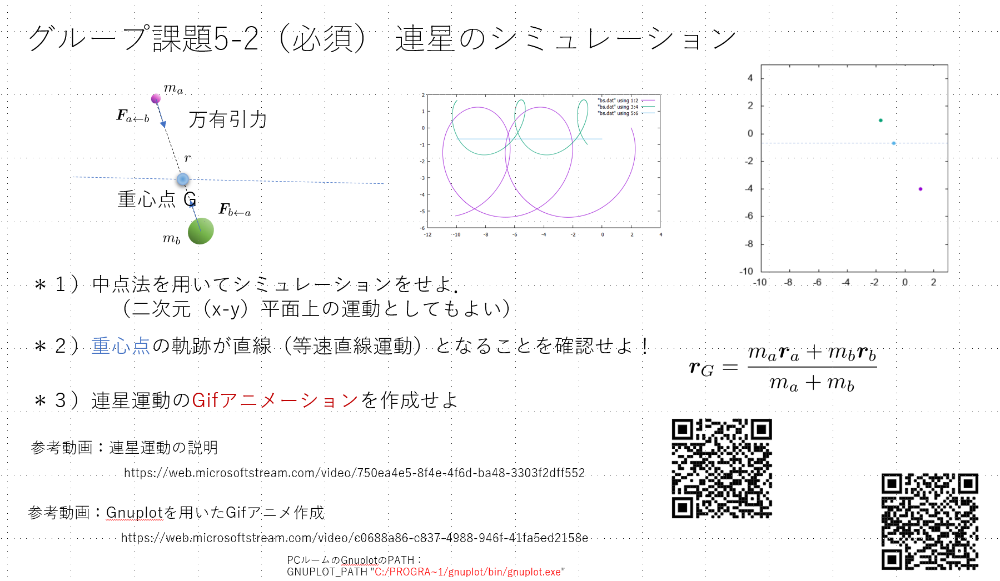

# 情報処理演習Ⅱ Binary Star Simulation

[動画url](https://shibaura3-my.sharepoint.com/personal/gen_sic_shibaura-it_ac_jp/_layouts/15/stream.aspx?id=%2Fpersonal%2Fgen%5Fsic%5Fshibaura%2Dit%5Fac%5Fjp%2FDocuments%2FStream%20Migrated%20Videos%2F%E6%83%85%E5%A0%B1%E5%87%A6%E7%90%86%E6%BC%94%E7%BF%92II%5F%E9%80%A3%E6%98%9F%E3%82%B7%E3%83%9F%E3%83%A5%E3%83%AC%E3%83%BC%E3%82%B7%E3%83%A7%E3%83%B3%E5%8F%82%E8%80%83%E5%8B%95%E7%94%BB%2D20210110%5F051740%2Emp4&referrer=StreamWebApp%2EWeb&referrerScenario=AddressBarCopied%2Eview)

## 概要

## 理論

### 連星とは

連星とは、2つの恒星が互いに万有引力により結びつき，それぞれ楕円軌道を描くものである．

### 連星の運動方程式

質点1,2をデカルト座標系で表す．
それぞれの質点1,2に対して，万有引力の法則より
質点1にかかる力は質点2から，質点2にかかる力は質点1からとなる．

$|\vec{F}_{1 \to 2}|=|\vec{F}_{2 \to 1}|=G\frac{m_1m_2}{r^2}$
$\vec{F}_{1 \to 2}=-\vec{F}_{2 \to 1}$

質点1の位置ベクトル$\vec{r_1}=(\vec{x_1},\vec{y_1})$，質点2の位置ベクトル$\vec{r_2}=(\vec{x_2},\vec{y_2})$とする．

運動方程式を立てると，

$$
\begin{align*}
    \begin{cases}
        m_1 \ddot{r}_1 &= \vec{F}_{1 \to 2} \\
        m_2 \ddot{r}_2 &= \vec{F}_{2 \to 1}
    \end{cases} \\
    \Leftrightarrow \quad
    \begin{aligned}
        &\begin{cases}
            m_1 \ddot{x}_1 &= (\vec{F}_{1 \to 2})_x \\
            m_1 \ddot{y}_1 &= (\vec{F}_{1 \to 2})_y
        \end{cases} \\
        &\begin{cases}
            m_2 \ddot{x}_2 &= (\vec{F}_{2 \to 1})_x \\
            m_2 \ddot{y}_2 &= (\vec{F}_{2 \to 1})_y
        \end{cases}
    \end{aligned}
\end{align*}
$$

ここで、質点1と質点2の位置ベクトルの差を
$$\vec{r_{12}}=\vec{r_2}-\vec{r_1}$$とすると，$\vec{F_{1 \to 2}} / \! / \vec{r_{12}}$となり，単位ベクトルを$\vec{e}$とすると
$$
\vec{F_{1 \to 2}}=|\vec{F_{1 \to 2}}|\vec{e}
$$
ベクトルの規格化$
\vec{e}=\frac{\vec{r_{12}}}{|\vec{r_{12}}|}$を行い，$|\vec{F}_{1 \to 2}|=|\vec{F}_{2 \to 1}|=G\frac{m_1m_2}{r^2}$とすると
$$
\begin{align*}
\vec{F_{1 \to 2}}
    &=|\vec{F_{1 \to 2}}|\frac{\vec{r_{12}}}{|\vec{r_{12}}|}\\
&=G\frac{m_1 m_2}{r^2}\frac{\vec{r_{12}}}{|\vec{r_{12}}|}\\
&=G\frac{m_1 m_2 }{r^3}(\vec{r_2}-\vec{r_1})
\end{align*}
$$
よって
$$
\begin{align*}
    \begin{cases}
        m_1 \ddot{x_1}=G\frac{m_1 m_2 }{r^3}(x_2-x_1) \\
        m_1 \ddot{y_1}=G\frac{m_1 m_2 }{r^3}(y_2-y_1) \\
    \end{cases}\\
\end{align*}
$$
また，質点2に働く力は質点1に働く力は逆向きであるから，
$$
\begin{align*}
    \begin{cases}
        m_2 \ddot{x_2}=-G\frac{m_1 m_2 }{r^3}(x_2-x_1) \\
        m_2 \ddot{y_2}=-G\frac{m_1 m_2 }{r^3}(y_2-y_1) \\
    \end{cases}\\
\end{align*}
$$
となる．

### 重心

重心は，質量の重み付き平均で表される．
質点1,2の重心を$\vec{r_g}$とすると(考え方：重心周りのモーメントは0になる)，
$$
\begin{align*}
    \vec{r_g}=\frac{m_1 \vec{r_1}+m_2 \vec{r_2}}{m_1+m_2}
\end{align*}
$$
この時x,y成分はそれぞれ
$$
\begin{cases}
    (\vec{r_g})_x=\frac{m_1 x_1+m_2 x_2}{m_1+m_2} \\
    (\vec{r_g})_y=\frac{m_1 y_1+m_2 y_2}{m_1+m_2}
\end{cases}
$$

## 検証

## 結果

## 考察
