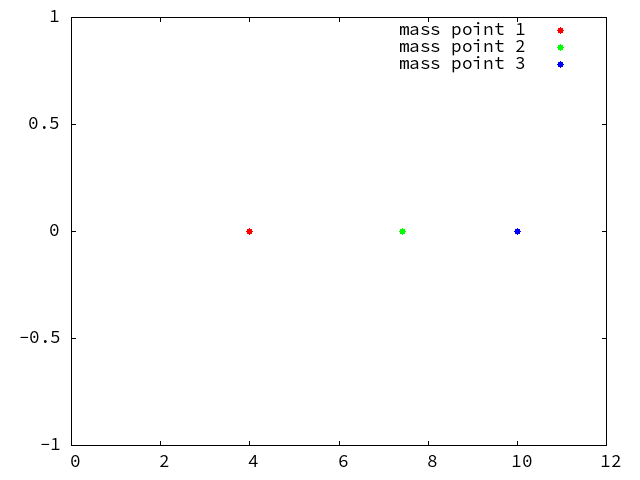
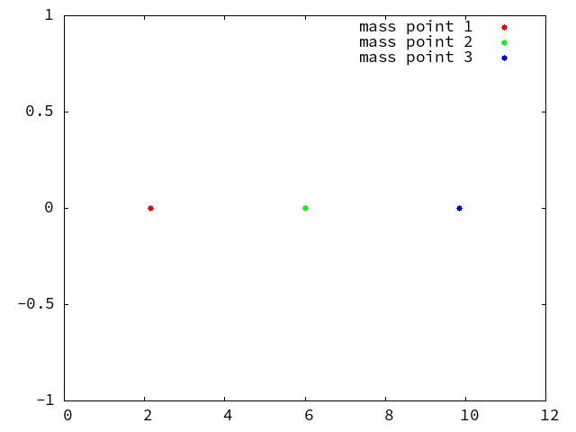
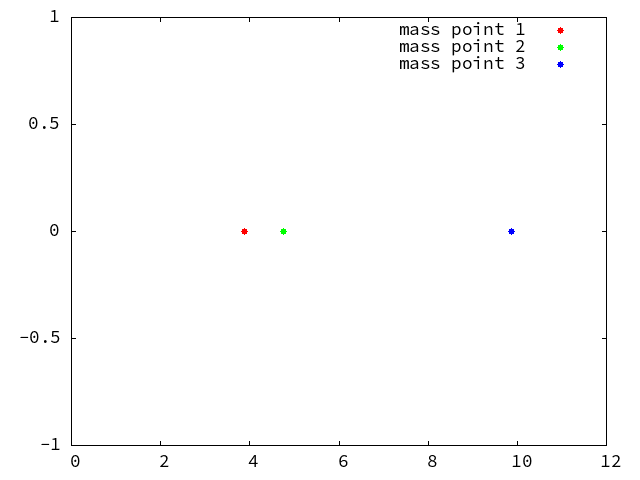

# 概要
多自由度連成振動のシミュレーションを行う．今回は，3自由度連成振動系のモードの運動を再現し，そのモードででのgifアニメーションを作成する．また，5自由度連成振動系でのgifアニメーションを作成した．これは，モードの運動は再現していない．

# 理論
## 3自由度連成振動系のモードの運動
それぞれの質点において$u_1$,$u_2$,$u_3$の変位を考える．
運動方程式は以下のようになる．この時$\omega_0=\sqrt{\frac{k}{m}}$とすると
$$
\begin{cases}
    m_1 \ddot{u_1} = -ku_1-k(u_1-u_2) = -2ku_1+ku_2 \\
    m_2 \ddot{u_2} = -ku_2-k(u_2-u_1)-k(u_2-u_3) = ku_1-2ku_2+ku_3 \\
    m_3 \ddot{u_3} = -ku_3-k(u_3-u_2) = ku_2-2ku_3
\end{cases}
\Leftrightarrow
\begin{cases}
    \ddot{u_1} = -2\omega_0^2 u_1+\omega_0^2 u_2\\
    \ddot{u_2} = \omega_0^2 u_1-2\omega_0^2 u_2+\omega_0^2 u_3\\
    \ddot{u_3} = \omega_0^2 u_2-2\omega_0^2 u_3
\end{cases}
$$

となる

ここで，$u_1$,$u_2$,$u_3$を以下のようと仮定する．
$$
\begin{cases}
    u_1 = A_1 \cos(\omega t + \phi) \\
    u_2 = A_2 \cos(\omega t + \phi) \\
    u_3 = A_3 \cos(\omega t + \phi)
\end{cases}
$$
微分したものは以下のようになる．
$$
\begin{cases}
    \dot{u_1} = -A_1 \omega \sin(\omega t + \phi) \\
    \dot{u_2} = -A_2 \omega \sin(\omega t + \phi) \\
    \dot{u_3} = -A_3 \omega \sin(\omega t + \phi)
\end{cases}
$$
$$
\begin{cases}
    \ddot{u_1} = -A_1 \omega^2 \cos(\omega t + \phi) \\
    \ddot{u_2} = -A_2 \omega^2 \cos(\omega t + \phi) \\
    \ddot{u_3} = -A_3 \omega^2 \cos(\omega t + \phi)
\end{cases}
$$

これを運動方程式に代入すると以下のようになる．
$$
\begin{cases}
    -A_1 \omega^2 \cos(\omega t + \phi) = -2\omega_0^2 A_1 \cos(\omega t + \phi)+\omega_0^2 A_2 \cos(\omega t + \phi)\\
    -A_2 \omega^2 \cos(\omega t + \phi) = \omega_0^2 A_1 \cos(\omega t + \phi)-2\omega_0^2 A_2 \cos(\omega t + \phi)+\omega_0^2 A_3 \cos(\omega t + \phi)\\
    -A_3 \omega^2 \cos(\omega t + \phi) = \omega_0^2 A_2 \cos(\omega t + \phi)-2\omega_0^2 A_3 \cos(\omega t + \phi)
\end{cases}
$$
$$
\Leftrightarrow
\begin{cases}
    -\omega^2 A_1 = -2\omega_0^2 A_1+\omega_0^2 A_2\\
    -\omega^2 A_2 = \omega_0^2 A_1-2\omega_0^2 A_2+\omega_0^2 A_3\\
    -\omega^2 A_3 = \omega_0^2 A_2-2\omega_0^2 A_3
\end{cases}
$$

これを行列で表すと以下のようになる．

$$
\begin{pmatrix}
    -\omega^2 & 0 & 0 \\
    0 & -\omega^2 & 0 \\
    0 & 0 & -\omega^2
\end{pmatrix}
\begin{pmatrix}
    A_1 \\
    A_2 \\
    A_3
\end{pmatrix}
=
\begin{pmatrix}
    -2\omega_0^2 & \omega_0^2 & 0 \\
    \omega_0^2 & -2\omega_0^2 & \omega_0^2 \\
    0 & \omega_0^2 & -2\omega_0^2
\end{pmatrix}
\begin{pmatrix}
    A_1 \\
    A_2 \\
    A_3
\end{pmatrix}
$$


ここで，固有値方程式を解くと以下のようになる．
$$
\det(\lambda E -X) = 0
$$

$$
\begin{vmatrix}
    \lambda +\omega^2 & 0 & 0 \\
    0 & \lambda +\omega^2 & 0 \\
    0 & 0 & \lambda +\omega^2
\end{vmatrix}
=0
$$

$$
(\lambda +\omega_0^2)^3 -2\omega_0^4(\lambda +\omega_0^2)^2=
(\lambda +\omega_0^2)^2[(\lambda +\omega_0^2) -2\omega_0^2]=0
$$

## モード1の時
$\lambda_1 = \sqrt{2-\sqrt{2}} \omega_0^2$なので

$$
\begin{pmatrix}
    -\omega^2 & 0 & 0 \\
    0 & -\omega^2 & 0 \\
    0 & 0 & -\omega^2
\end{pmatrix}
\begin{pmatrix}
    A_1 \\
    A_2 \\
    A_3
\end{pmatrix}
=
\sqrt{2-\sqrt{2}} \omega_0^2
\begin{pmatrix}
    A_1 \\
    A_2 \\
    A_3
\end{pmatrix}
$$

$$
\begin{cases}
    A_2 = \sqrt{2} A_1 \\
    A_3 = \sqrt{2} A_2 = 2 A_1
\end{cases}
$$

## モード2の時
$\lambda_2 = \sqrt{2} \omega_0^2$なので

$$
\begin{pmatrix}
    -\omega^2 & 0 & 0 \\
    0 & -\omega^2 & 0 \\
    0 & 0 & -\omega^2
\end{pmatrix}
\begin{pmatrix}
    A_1 \\
    A_2 \\
    A_3
\end{pmatrix}
=
\sqrt{2} \omega_0^2
\begin{pmatrix}
    A_1 \\
    A_2 \\
    A_3
\end{pmatrix}
$$

$$
\begin{cases}
    A_2 = 0 \\
    A_3 = -A_1 
\end{cases}
$$

## モード3の時
$\lambda_3 = \sqrt{2+\sqrt{2}} \omega_0^2$なので

$$
\begin{pmatrix}
    -\omega^2 & 0 & 0 \\
    0 & -\omega^2 & 0 \\
    0 & 0 & -\omega^2
\end{pmatrix}
\begin{pmatrix}
    A_1 \\
    A_2 \\
    A_3
\end{pmatrix}
=
\sqrt{2+\sqrt{2}} \omega_0^2
\begin{pmatrix}
    A_1 \\
    A_2 \\
    A_3
\end{pmatrix}
$$

$$
\begin{cases}
    A_2 = -\sqrt{2} A_1 \\
    A_3 = -A_1
\end{cases}
$$

# 検証
今回は[@lst:CoupledVibrationMid.c]を用いて検証を行う．モードの値は理論の章で求めた値を用いる．また，初期条件は，条件のみを指定することで自動的に初期条件を算出するプログラムを用いることとした．

また，モードの動きを再現するために，gifアニメーションを用いた．pdfファイルには，gifアニメーションを表示することができないため，gifアニメーションはScomb上にアップロードした．
gifアニメーションは，ポインタを用いて，データを全て書き出し，再度新たなポインタを用いて，gnuplotを立ち上げ，そのgnuplotにデータを送ることで作成した．

```{.c #lst:CoupledVibrationMid.c caption="CoupledVibrationMid.c"}
#include <stdio.h>
#include <math.h>
#include <stdlib.h>
#include <time.h>

const double k = 1;  // バネ定数
const double m = 2;  // 質量 kg
const double l = 3;  // バネ自然長


double fu1(double u1, double u2, double u3) {
    return -2*k*u1+k*u2;
}

double fu2(double u1, double u2, double u3) {
    return k*u1-2*k*u2+k*u3;
}

double fu3(double u1, double u2, double u3) {
    return -2*k*u3+k*u2;
}

int main() {

    srand((unsigned)time(NULL));

    double w0, w1, w2, w3;
    double t0, t1, dt, ddt, t;
    double u1, u2, u3, vu1, vu2, vu3, u1_0, u2_0, u3_0, vu1_0, vu2_0, vu3_0;
    double ku1, kvu1, ku2, kvu2, ku3, kvu3;
    int numi, nump, i;

    double A1, A2, A3, B1, B2, B3, C1, C2, C3, phi1, phi2, phi3;

    w0 = sqrt(k/m);
    w1 = sqrt(2-sqrt(2))*w0;
    w2 = sqrt(2)*w0;
    w3 = sqrt(2+sqrt(2))*w0;
    
    int j;
    for(j = 1; j<4; j++){

    if(j==1){
        A1 = 1;
        A2 = 0;
        A3 = 0;
        B1 = sqrt(2);
        B2 = 0;
        B3 = 0;
        C1 = 1;
        C2 = 0;
        C3 = 0;
        phi1 = 0;
        phi2 = 0;
        phi3 = 0;
    } else if(j==2){
        A1 = 0;
        A2 = 1;
        A3 = 0;
        B1 = 0;
        B2 = 0;
        B3 = 0;
        C1 = 0;
        C2 = -1;
        C3 = 0;
        phi1 = 0;
        phi2 = 0;
        phi3 = 0;
    } else {
        A1 = 0;
        A2 = 0;
        A3 = 1;
        B1 = 0;
        B2 = 0;
        B3 = -sqrt(2);
        C1 = 0;
        C2 = 0;
        C3 = 1;
        phi1 = 0;
        phi2 = 0;
        phi3 = 0;
    }

    u1_0 = A1 * cos (w1 * t + phi1) + A2 * cos (w2 * t + phi2) + A3 * cos (w3 * t + phi3);
    u2_0 = B1 * cos (w1 * t + phi1) + B2 * cos (w2 * t + phi2) + B3 * cos (w3 * t + phi3);
    u3_0 = C1 * cos (w1 * t + phi1) + C2 * cos (w2 * t + phi2) + C3 * cos (w3 * t + phi3);
    vu1_0 = -w1 * A1 * sin (w1 * t + phi1) - w2 * A2 * sin (w2 * t + phi2) - w3 * A3 * sin (w3 * t + phi3);
    vu2_0 = -w1 * B1 * sin (w1 * t + phi1) - w2 * B2 * sin (w2 * t + phi2) - w3 * B3 * sin (w3 * t + phi3);
    vu3_0 = -w1 * C1 * sin (w1 * t + phi1) - w2 * C2 * sin (w2 * t + phi2) - w3 * C3 * sin (w3 * t + phi3);


    printf("【u1_0=%.3f u2_0=%.3f u3_0=%.3f vu1_0=%.3f vu2_0=%.3f vu3_0=%.3f】\n\n", u1_0, u2_0, u3_0, vu1_0, vu2_0, vu3_0);

    t0 = 0;
    t1 = 10.0;

    dt = 0.001;
    numi = (t1 - t0) / dt;

    t = t0;
    u1 = u1_0;
    u2 = u2_0;
    u3 = u3_0;
    vu1 = vu1_0;
    vu2 = vu2_0;
    vu3 = vu3_0;
    
    FILE *fp;
    char filename[100];
    sprintf(filename, "CoupledVibrationMid_anime_3_mode%d.dat",j);
    fp = fopen(filename, "w");

    ddt = 0.1;
    nump = ddt / dt;

    for (i = 0; i < numi; i++) {
        if (i % nump == 0) {
            // fprintf(fp, "%f %f %f %f 0\n", t, u1, u2, u3);
            fprintf(fp, "%f %f %f %f %d\n", t, u1, u2, u3, 0);
        }

        ku1=u1+(dt/2)*vu1;
        ku2=u2+(dt/2)*vu2;
        ku3=u3+(dt/2)*vu3;
        kvu1=vu1+(dt/2)*fu1(u1,u2,u3)/m;
        kvu2=vu2+(dt/2)*fu2(u1,u2,u3)/m;
        kvu3=vu3+(dt/2)*fu3(u1,u2,u3)/m;
        u1=u1+dt*kvu1;
        u2=u2+dt*kvu2;
        u3=u3+dt*kvu3;
        vu1=vu1+dt*fu1(ku1,ku2,ku3)/m;
        vu2=vu2+dt*fu2(ku1,ku2,ku3)/m;
        vu3=vu3+dt*fu3(ku1,ku2,ku3)/m;
        t=t+dt;
    }

    fflush(fp);
    fclose(fp);

	// 新たにgnuplotのプロセスを立ち上げるポインタを定義
    FILE *gp;
    gp = popen("gnuplot -persist", "w");

    // Gnuplotのコマンドを送る
    const char *gnuplotScript1 =\
        "plot \
        \"CoupledVibrationMid_anime_3_mode%d.dat\" u 1:2 w l title \"mass point 1\", \
        \"CoupledVibrationMid_anime_3_mode%d.dat\" u 1:3 w l title \"mass point 2\", \
        \"CoupledVibrationMid_anime_3_mode%d.dat\" u 1:4 w l title \"mass point 1\"\n";

    // Gnuplotのプロセスにコマンドを送る
    fprintf(gp, gnuplotScript1, j, j, j);

    // プロセスを閉じる
    pclose(gp);

    }

    return 0;
}

```

# 結果
## モード1の時
[@fig:mode1]がモード1の時の運動の再現である．

{#fig:mode1 height=30%}

\clearpage

## モード2の時
[@fig:mode2]がモード2の時の運動の再現である．

{#fig:mode2 height=30%}

## モード3の時
[@fig:mode3]がモード3の時の運動の再現である．

{#fig:mode3 height=30%}

# 考察

結果から，明らかなように，モードの運動が再現できていると言える．理論通りの結果が得られた．
