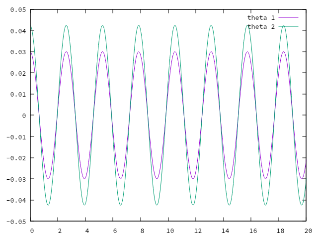
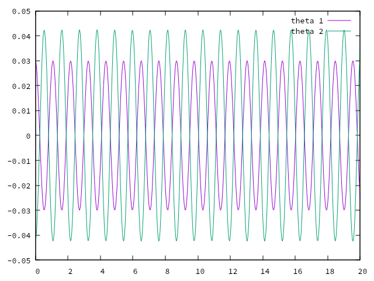

# 理論

## 一般の場合

質点1の質量を$m_1$としてのx,z座標をそれぞれ$x_1,z_1$とする．質点2の質量を$m_2$として$のx,z座標はそれぞれ$x_2,z_2$となる。
それぞれ鉛直方向からの角度を$\theta_1$,$\theta_2$とする．

座標は以下のようにとる．
運動学の関係式は
$$
\begin{cases}
x_1 = l_1\sin\theta_1 \\
z_1 = -l_1\cos\theta_1 
\end{cases}
$$
$$
\begin{cases}
x_2 = l_1\sin\theta_1 + l_2\sin\theta_2 \\
z_2 = -l_1\cos\theta_1 - l_2\cos\theta_2
\end{cases}
$$

それぞれ微分すると
$$
\begin{cases}
\dot{x_1} = l_1\dot{\theta_1}\cos\theta_1 \\
\dot{z_1} = -l_1\dot{\theta_1}\sin\theta_1
\end{cases}
$$
$$
\begin{cases}
\dot{x_2} = \dot{x_1} + l_2\dot{\theta_2}\cos\theta_2 \\
\dot{z_2} = \dot{z_1} - l_2\dot{\theta_2}\sin\theta_2
\end{cases}
$$

再度微分すると
$$
\begin{cases}
\ddot{x_1} = -l_1\dot{\theta_1}^2\sin\theta_1 + l_1\ddot{\theta_1}\cos\theta_1 \\
\ddot{z_1} = -l_1\dot{\theta_1}^2\cos\theta_1 - l_1\ddot{\theta_1}\sin\theta_1
\end{cases}
$$
$$
\begin{cases}
\ddot{x_2} = \ddot{x_1} - l_2\dot{\theta_2}^2\sin\theta_2 + l_2\ddot{\theta_2}\cos\theta_2 \\
\ddot{z_2} = \ddot{z_1} - l_2\dot{\theta_2}^2\cos\theta_2 - l_2\ddot{\theta_2}\sin\theta_2
\end{cases}
$$


運動方程式は
$$
\begin{cases}
m_1\ddot{x_1} = -T_1\sin\theta_1 - +T_2\sin\theta_2 \\
m_1\ddot{z_1} = -T_1\cos\theta_1 - +T_2\cos\theta_2 + m_1g \\
\end{cases}
\cdots(e1)
$$
$$
\begin{cases}
m_2\ddot{x_2} = -T_2\sin\theta_2 \\
m_2\ddot{z_2} = -T_2\cos\theta_2 + m_2g \\
\end{cases}
\cdots(e2)
$$
となる．

e1にe2を代入すると
$$
\begin{cases}
m_1\ddot{x_1} = -T_1\sin\theta_1 + (-m_2 \ddot(x_2)) \\
m_1\ddot{z_1} = -T_1\cos\theta_1 + (- m_2 \ddot(z_2)+m_2g) + m_1g \\
\end{cases}\\
\Leftrightarrow
\begin{cases}
m_1\ddot{x_1} + m_2 \ddot(x_2) = -T_1\sin\theta_1 \\
m_1\ddot{z_1} + m_2 \ddot(z_2) - (m_2g + m_1g) = -T_1\cos\theta_1
\end{cases}
$$

それぞれに$\cos(\theta_1)$と$\sin(\theta_1)$をかけて合わせると

$$
\begin{cases}
\cos(\theta_1)(m_1\ddot{x_1} + m_2 \ddot(x_2)) = -T_1\sin\theta_1\cos\theta_1 \\
\sin(\theta_1)(m_1\ddot{z_1} + m_2 \ddot(z_2) - (m_2g + m_1g)) = -T_1\sin\theta_1\cos\theta_1
\end{cases}
$$

よって
$$
\cos\theta_1(m_1\ddot{x_1} + m_2 \ddot(x_2)) = \sin\theta_1(m_1\ddot{z_1} + m_2 \ddot(z_2) - (m_2g + m_1g))
$$
を得る．

e2を式変形したもに$sin\theta_2$と$\cos\theta_2$をかけて合わせると
$$
\begin{cases}
\cos\theta_2(m_2\ddot{x_2}) = -T_2\sin\theta_2\cos\theta_2 \\
\sin\theta_2(m_2\ddot{z_2} - m_2g) = -T_2\sin\theta_2\cos\theta_2
\end{cases}
\cdots(e3)
$$

運動学の視点から求めた式に$e3$を代入すると
$$
\begin{cases}
\ddot\theta_1 = \frac{m_2l_1l_2\sin(\theta_1-\theta_2)\cos(\theta_1-\theta_2)\dot(\theta_1)^ - m_2l_2^2\sin(\theta_1-\theta_2)\dot(\theta_2)^2 + ((m_2\sin(\theta_2)\cos(\theta_1-\theta_2)-(m_1+m_2)\sin(\theta_1)l_2g)}{l_1l_2(m_1-m_2-m_2\cos^2(\theta_1-\theta_2))} \\
\ddot\theta_2 = \frac{(m_1+m_2)l_1^2\sin(\theta_1-\theta_2)\dot(\theta_1)^2-m_2l_1l_2\sin(\theta_1-\theta_2)\cos(\theta_1-\theta_2)\dot(\theta_2)^2 + ((m_1+m_2)\sin(\theta_1)\cos(\theta_1-\theta_2)-\sin(\theta_2))l_1g}{l_1l_2(m_1-m_2-m_2\cos^2(\theta_1-\theta_2))}
\end{cases}
$$

一階の微分方程式に変形すると
$\dot\theta_1=\omega_1$かつ$\dot\theta_2=\omega_2$とあらわせるので

$$
\begin{cases}
\dot\omega_1 = \frac{m_2l_1l_2\sin(\theta_1-\theta_2)\cos(\theta_1-\theta_2)\omega_1^2 - m_2l_2^2\sin(\theta_1-\theta_2)\omega_2^2 + ((m_2\sin(\theta_2)\cos(\theta_1-\theta_2)-(m_1+m_2)\sin(\theta_1)l_2g)}{l_1l_2(m_1-m_2-m_2\cos^2(\theta_1-\theta_2))} \\
\dot\omega_2 = \frac{(m_1+m_2)l_1^2\sin(\theta_1-\theta_2)\omega_1^2-m_2l_1l_2\sin(\theta_1-\theta_2)\cos(\theta_1-\theta_2)\omega_2^2 + ((m_1+m_2)\sin(\theta_1)\cos(\theta_1-\theta_2)-\sin(\theta_2))l_1g}{l_1l_2(m_1-m_2-m_2\cos^2(\theta_1-\theta_2))}
\end{cases}
$$

## 微小角振動の場合
$$
|\theta_1|,|\theta_2| \ll 1 
\\
|\dot\theta_1|,|\dot\theta_2| \ll 1
$$
とする．
すると，
$$
\sin\theta \approx \theta \\
\cos\theta \approx 1
$$
と近似できる．

$$
\begin{cases}
\ddot\theta_1 = \frac{(m_2\sin(\theta_2)\cos(\theta_1-\theta_2)-(m_1+m_2)\theta_1)l_2g}{l_1l_2(m_1-m_2-m_2\cos^2(\theta_1-\theta_2))} \\
\ddot\theta_2 = \frac{(m_1+m_2)(\sin(\theta_1)\cos(\theta_1-\theta_2)-\sin(\theta_2))l_1g}{l_1l_2(m_1+m_2-m_2\cos^2(\theta_1-\theta_2)}
\end{cases}
$$

ここで，$m_1=m_2=m$, $l_1=l_2=l$とすると
$$
\begin{cases}
\ddot\theta_1 = \frac{(\theta_2-2\theta_1)g}{l}\\
\ddot\theta_2 = \frac{2(\theta_1-\theta_2)g}{l}
\end{cases}
$$

これは，定数係数の連立常微分方程式である．

## モードMの時

$\omega_0=\sqrt\frac{l}{g}$とすると
$$
\omega = \sqrt{2-\sqrt{2}\omega_0}
$$
となる．

初期条件は
$$
\begin{cases}
\theta_2(0) = \sqrt{2}\theta_1(0) \\
\omega_1(0) = \omega_2(0) = 0
\end{cases}
$$
となる．

## モードPの時

$\omega_0=\sqrt\frac{l}{g}$とすると

$$
\omega = \sqrt{2+\sqrt{2}\omega_0}
$$
となる．

初期条件は
$$
\begin{cases}
\theta_2(0) = - \sqrt{2}\theta_1(0) \\
\omega_1(0) = \omega_2(0) = 0
\end{cases}
$$
となる．

# 検証
理論の章で求めた通り，初期条件を指定して，モードMとモードPの時の運動を再現する．[@lst:double_pendulum_mode.c]が実際に作成したプログラムである．


```{.c caption="double_pendulum_mode.c" #lst:double_pendulum_mode.c}
#include <stdio.h>
#include <math.h>

// シミュレーションパラメータ
const double l = 1.0;  // 振り子の長さ
const double g = 9.8;  // 重力加速度

// 微分方程式
double differential_equations(double theta1, double omega1, double theta2, double omega2,
                            double *dtheta1, double *domega1, double *dtheta2, double *domega2) {
    *dtheta1 = omega1;
    *domega1 = ((theta2 - 2 * theta1) * g) / l;
    *dtheta2 = omega2;
    *domega2 = (2 * (theta1 - theta2) * g) / l;
}

int main() {
    double w0, w_M, w_P;
    double theta1_0, theta2_0, omega1_0, omega2_0;
    double t0, t1, dt, ddt, t;
    double theta1, theta2, omega1, omega2;
    double k1_theta1, k1_omega1, k2_theta1, k2_omega1;
    double k1_theta2, k1_omega2, k2_theta2, k2_omega2;
    double dtheta1, domega1, dtheta2, domega2;
    int numi, nump, i;

    w0 = sqrt(l / g);
    w_M = sqrt(2 - sqrt(2)) * w0;
    w_P = sqrt(2 + sqrt(2)) * w0;

    theta1_0 = 0.03;
    theta2_0 = sqrt(2) * theta1_0;
    omega1_0 = 0;
    omega2_0 = 0;

    t0 = 0;
    t1 = 20.0;
    theta1 = theta1_0;
    theta2 = theta2_0;
    omega1 = omega1_0;
    omega2 = omega2_0;

    dt = 0.001;
    numi = (t1 - t0) / dt;

    ddt = 0.5;
    nump = (t1 - t0) / ddt;

    FILE *fp;
    fp = fopen("data1.dat", "w");

    for (i = 1; i <= numi; i++) {
        if (i % nump == 0) {
            printf("%f %f %f %f %f\n", t, theta1, theta2, omega1, omega2);
            fprintf(fp, "%f %f %f %f %f\n", t, theta1, theta2, omega1, omega2);
        }

        // 中点法
        differential_equations(theta1, omega1, theta2, omega2, &dtheta1, &domega1, &dtheta2, &domega2);

        double k1_theta1 = dt * dtheta1;
        double k1_omega1 = dt * domega1;
        double k1_theta2 = dt * dtheta2;
        double k1_omega2 = dt * domega2;

        differential_equations(theta1 + k1_theta1/2.0, omega1 + k1_omega1/2.0, theta2 + k1_theta2/2.0, omega2 + k1_omega2/2.0, &dtheta1, &domega1, &dtheta2, &domega2);

        double k2_theta1 = dt * dtheta1;
        double k2_omega1 = dt * domega1;
        double k2_theta2 = dt * dtheta2;
        double k2_omega2 = dt * domega2;

        theta1 = theta1 + k2_theta1;
        omega1 = omega1 + k2_omega1;
        theta2 = theta2 + k2_theta2;
        omega2 = omega2 + k2_omega2;
        
        t = t + dt;
    }
    fflush(fp);
    fclose(fp);
    
    FILE *gp;
    gp = popen("gnuplot -persist", "w");
    fprintf(gp, "plot \"data1.dat\" u 1:2 w l title \"theta 1\", \"data1.dat\" u 1:3 w l title \"theta 2\"\n");
    fflush(gp);
    fclose(gp);

    return 0;
}
```

\clearpage

# 結果
モードMの時の結果を図1に示す．

{height=35%}

モードPの時の結果を図2に示す．

{height=35%}

初期条件を$\theta_1=2.7$,$\theta_2=\sqrt{\theta_1}$,$\omega_1=1.0$.$\omega_2=1.0$と設定したときに，カオスを観測した．その結果を図3,図4に示す．

{height=35%}

{height=35%}

# 考察

結果から明らかなように，モードの運動が再現できていると言える．また図3,図4から少しの初期条件の変化で，その後の結果が大きく変化するカオス現象が観測できたと言える．