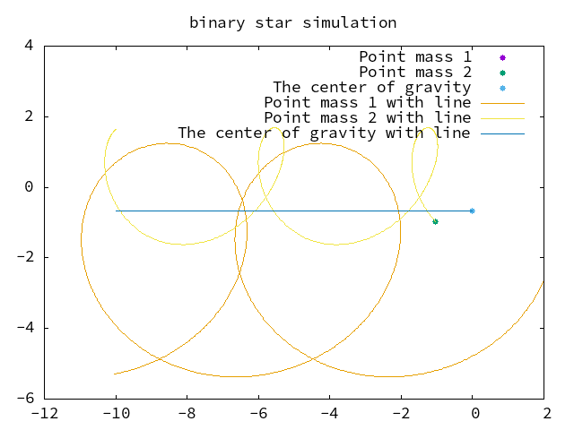
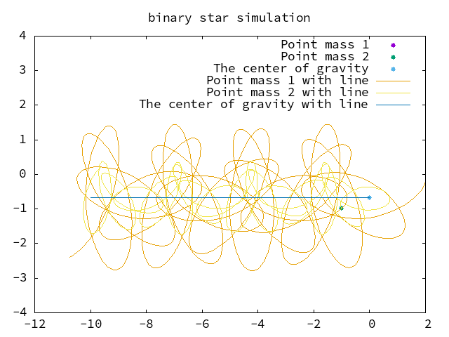
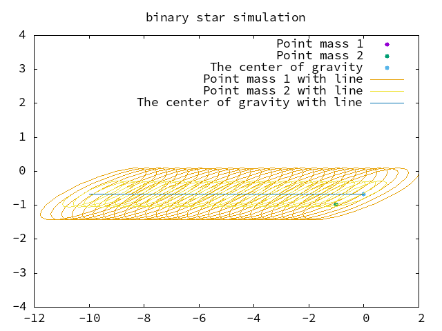
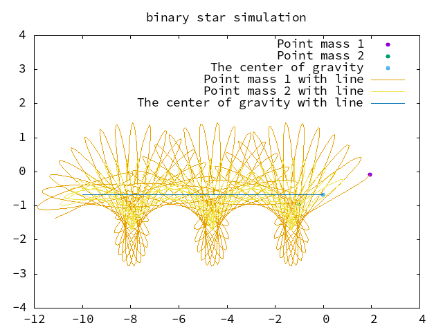
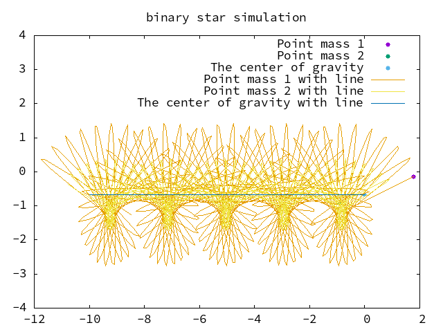

| 役職            | 学籍番号 |   名前   |担当章| 備考 |
| -------------- |--------| ------- | ---|---- |
| リーダー         | BQ23107 | 窪田 大輝 | 理論/検証 |      |
| プログラムリーダー | BQ23008 | 脇家 優太 | 検証  |      |
| 企画係           | BQ23071 | 平川 奨   | 理論 |     |
| 連絡係           | BQ23060 | 塚田 水月 | 考察  |      |
| 書記１           | BQ23110 | 信賀 晃   |   |     |
| 書記２           | BQ23103 | 山田 泰我 |   |     |

# 概要
今回は万有引力が距離の?乗に比例するときのシミュレーションを行う．？には-3,-2,-1,0,1,2,3の値を入れ，それぞれの場合でgifアニメーションを作成する．

# 理論

## 距離の３乗に比例するときの連星の運動方程式
一例として，距離の３乗に比例するときの連星の運動方程式を示す．

{#fig:Schematic_diagram_of_binary_stars height=45%}

[@fig:Schematic_diagram_of_binary_stars]に連星の模式図を示す．
質点1,2をデカルト座標系で表す．それぞれの質点1,2に対して，万有引力の法則より質点1にかかる力は質点2から，質点2にかかる力は質点1からとなる．

$|\vec{F}_{1 \to 2}|=|\vec{F}_{2 \to 1}|=G\frac{m_1m_2}{r^3}$
$\vec{F}_{1 \to 2}=-\vec{F}_{2 \to 1}$

質点1の位置ベクトル$\vec{r_1}=(\vec{x_1},\vec{y_1})$，質点2の位置ベクトル$\vec{r_2}=(\vec{x_2},\vec{y_2})$とする．

運動方程式を立てると，


$$
    \begin{cases}
        m_1 \ddot{r}_1 &= \vec{F}_{1 \to 2} \\
        m_2 \ddot{r}_2 &= \vec{F}_{2 \to 1}
    \end{cases} \\
    \Leftrightarrow \quad
    \begin{aligned}
        &\begin{cases}
            m_1 \ddot{x}_1 &= (\vec{F}_{1 \to 2})_x \\
            m_1 \ddot{y}_1 &= (\vec{F}_{1 \to 2})_y
        \end{cases} \\
        &\begin{cases}
            m_2 \ddot{x}_2 &= (\vec{F}_{2 \to 1})_x \\
            m_2 \ddot{y}_2 &= (\vec{F}_{2 \to 1})_y
        \end{cases}
    \end{aligned}
$$

ここで、質点1と質点2の位置ベクトルの差を
$$\vec{r_{12}}=\vec{r_2}-\vec{r_1}$$とすると，$\vec{F_{1 \to 2}} / \! / \vec{r_{12}}$となり，単位ベクトルを$\vec{e}$とすると
$$
\vec{F_{1 \to 2}}=|\vec{F_{1 \to 2}}|\vec{e}
$$
ベクトルの規格化$\vec{e}=\frac{\vec{r_{12}}}{|\vec{r_{12}}|}$を行い，$|\vec{F}_{1 \to 2}|=|\vec{F}_{2 \to 1}|=G\frac{m_1m_2}{r^3}$とすると

$$
\vec{F_{1 \to 2}} = |\vec{F_{1 \to 2}}|\frac{\vec{r_{12}}}{|\vec{r_{12}}|} = G\frac{m_1 m_2}{r^3}\frac{\vec{r_{12}}}{|\vec{r_{12}}|} = G\frac{m_1 m_2 }{r^4}(\vec{r_2}-\vec{r_1})
$$

<!-- \begin{align*}
\vec{F_{1 \to 2}} &= |\vec{F_{1 \to 2}}|\frac{\vec{r_{12}}}{|\vec{r_{12}}|} \\
&= G\frac{m_1 m_2}{r^2}\frac{\vec{r_{12}}}{|\vec{r_{12}}|} \\
&= G\frac{m_1 m_2 }{r^3}(\vec{r_2}-\vec{r_1})
\end{align*} -->


よって


$$
    \begin{cases}
        m_1 \ddot{x_1}=G\frac{m_1 m_2 }{r^4}(x_2-x_1) \\
        m_1 \ddot{y_1}=G\frac{m_1 m_2 }{r^4}(y_2-y_1) \\
    \end{cases}\\
$$

また，質点2に働く力は質点1に働く力は逆向きであるから，

$$
    \begin{cases}
        m_2 \ddot{x_2}=-G\frac{m_1 m_2 }{r^4}(x_2-x_1) \\
        m_2 \ddot{y_2}=-G\frac{m_1 m_2 }{r^4}(y_2-y_1) \\
    \end{cases}\\
$$

となる．

## 重心

重心は，質量の重み付き平均で表される．
質点1,2の重心を$\vec{r_g}$とすると(考え方：重心周りのモーメントは0になる)，

$$
    \vec{r_g}=\frac{m_1 \vec{r_1}+m_2 \vec{r_2}}{m_1+m_2}
$$

この時x,y成分はそれぞれ
$$
\begin{cases}
    (\vec{r_g})_x=\frac{m_1 x_1+m_2 x_2}{m_1+m_2} \\
    (\vec{r_g})_y=\frac{m_1 y_1+m_2 y_2}{m_1+m_2}
\end{cases}
$$

# 検証

以下の[@lst:code]のプログラムが検証に用いたプログラムである．中点法を用いている．

```{#lst:code .c  caption="binary_star_simulation.c"}

#include<stdio.h>
#include<math.h>

const double m1 = 1.0; // 質点1の質量
const double m2 = 2.0; // 質点2の質量
const double G = 10.0; // 描画しやすいような値にする

double r(double x1, double y1, double x2, double y2) { //質点1と質点2の距離
    return sqrt(pow(x1-x2, 2) + pow(y1-y2, 2));
}

double grax(double x1, double y1, double x2, double y2) { //質点1と質点2のx方向の引力
    return G*m1*m2*(x2-x1) / (pow(r(x1, y1, x2, y2), 4)); 
}

double gray(double x1, double y1, double x2, double y2) { //質点1と質点2のy方向の引力
    return G*m1*m2*(y2-y1) / (pow(r(x1, y1, x2, y2), 4));
}

double cgx(double x1, double y1, double x2, double y2){ //重心点を表すx方向の関数
    return (m1*x1+m2*x2)/(m1+m2);
}

double cgy(double x1, double y1, double x2, double y2){ //重心点を表すy方向の関数
    return (m1*y1+m2*y2)/(m1+m2);
}

int main(){

    double t0,t1,x10,x20,vx10,vx20,y10,y20,vy10,vy20,x1,x2,vx1,vx2,y1,y2,vy1,vy2,vmax,dt;
    double k1x,k1y,k1vx,k1vy,k2x,k2y,k2vx,k2vy;
    int i,nint;

    t0 = 0.0; //初期時刻
    t1 = 30.0; //終了時刻
    
    x10 = 2.0;
    y10 = 0.0;
    vx10 = 1.0;
    vy10 = -2.0;

    x20 = -1.0;
    y20 = -1.0;
    vx20 = -1.0;
    vy20 = 1.0;

    x1 = x10;
    x2 = x20;
    y1 = y10;
    y2 = y20;

    vx1 = vx10;
    vx2 = vx20;
    vy1 = vy10;
    vy2 = vy20;

    dt = 0.0001; //中点法の時間の刻み幅
    nint = (t1-t0)/dt;

    FILE *fp;
    fp = fopen("binary_star_simulation_3.dat", "w");

    for(i=1; i<=nint; i++){
        if(i%300 == 0){
            fprintf(fp,"%f %f %f %f %f %f\n", x1, y1, x2, y2, cgx(x1, y1, x2, y2), cgy(x1, y1, x2, y2));
        }
        k1x = x1 + dt/2*vx1;
        k1y = y1 + dt/2*vy1;
        k1vx = vx1 + dt/2*(grax(x1, y1, x2, y2))/m1;
        k1vy = vy1 + dt/2*(gray(x1, y1, x2, y2))/m1;

        k2x = x2 + dt/2*vx2;
        k2y = y2 + dt/2*vy2;
        k2vx = vx2 + dt/2*(grax(x2, y2, x1, y1))/m2;
        k2vy = vy2 + dt/2*(gray(x2, y2, x1, y1))/m2;
        
        x1 = x1 + dt*k1vx;
        y1 = y1 + dt*k1vy;
        vx1 = vx1 + dt*(grax(k1x, k1y, k2x, k2y))/m1;
        vy1 = vy1 + dt*(gray(k1x, k1y, k2x, k2y))/m1;

        x2 = x2 + dt*k2vx;
        y2 = y2 + dt*k2vy;
        vx2 = vx2 + dt*(grax(k2x, k2y, k1x, k1y))/m2;
        vy2 = vy2 + dt*(gray(k2x, k2y, k1x, k1y))/m2;
    }

    fflush(fp);
    fclose(fp);

    // 新たにgnuplotのプロセスを立ち上げるポインタを定義
    FILE *gp;
    gp = popen("gnuplot -persist", "w");

    // Gnuplotに送るコマンドを定義
    char *gnuplotscript =\
        "set terminal gif animate delay 5 optimize size 640,480\n"
        "set output \"binary_star_simulation_3.gif\"\n"
        "set title \"binary star simulation\"\n"
        "do for [i=0:999] {\n"
        "plot [-20:20][-20:20]\"binary_star_simulation_3.dat\" every ::i::i using 1:2 w p pt 7 ps 1 title \"Point mass 1\",\\\n"
        "                  \"binary_star_simulation_3.dat\" every ::i::i using 3:4 w p pt 7 ps 1 title \"Point mass 2\",\\\n"
        "                  \"binary_star_simulation_3.dat\" every ::i::i using 5:6 w p pt 7 ps 1 title \"The center of gravity\", \\\n"
        "                  \"binary_star_simulation_3.dat\" using 1:2 w l title \"Point mass 1 with line\", \\\n"
        "                  \"binary_star_simulation_3.dat\" using 3:4 w l title \"Point mass 2 with line\", \\\n"
        "                  \"binary_star_simulation_3.dat\" using 5:6 w l title \"The center of gravity with line\"\n"
        "}\n"
        "unset output\n";  //明示的に終了

    // Gnuplotのプロセスにコマンドを送る
    fprintf(gp, "%s", gnuplotscript);

    // プロセスを閉じる
    pclose(gp);

    return 0;
}

```


以下は上記のプログラムの内，アニメーションを作成するためのプログラムを抜粋したものである．逐一ポインタから渡すのは面倒であるし，コードが読みにくくなる．それを解消するために，ポインタgpに渡す文字列を定義している．この文字列はgnuplotのコマンドと同様である．
以下がそのプログラムの流れを説明したものである．

1. datファイルに必要なデータを書き出す

    ```{.c}
    FILE *fp;
    fp = fopen("binary_star_simulation.dat", "w");
    ```

    と記述し，`fprintf(fp,~~~)`でポインタを介してbinary_star_simulation.datにデータを書き出す．
2. gnuplotのコマンドを文字列として定義しておく．

    ```c{.c}
    FILE *gp;
    gp = popen("gnuplot -persist", "w");
    ```

    と記述し，`fprintf(gp,~~~)`でポインタを介してgnuplotのコマンドを送る．

3. gnuplotのコマンドをポインタに渡す．
    渡した内容は以下の通りである．
    1. gifアニメーションを作成するための設定
    2. 繰り返しを用いてデータファイルをプロットするための設定

    これらを記述して実行し，gifアニメーションを作成する．

\clearpage
# 結果

## 距離の3乗に比例するときのシミュレーション
[@fig:binary_star_simulation_3]に連星のシミュレーションの結果を示す．

{#fig:binary_star_simulation_3 height=32%}

## 距離の2乗に比例するときのシミュレーション
[@fig:binary_star_simulation_2]に連星のシミュレーションの結果を示す．

{#fig:binary_star_simulation_2 height=32%}

## 距離の1乗に比例するときのシミュレーション
[@fig:binary_star_simulation_1]に連星のシミュレーションの結果を示す．

{#fig:binary_star_simulation_1 height=32%}

## 距離の0乗に比例するときのシミュレーション
[@fig:binary_star_simulation_0]に連星のシミュレーションの結果を示す．

{#fig:binary_star_simulation_0 height=32%}

## 距離の-1乗に比例するときのシミュレーション
[@fig:binary_star_simulation_-1]に連星のシミュレーションの結果を示す．

{#fig:binary_star_simulation_-1 height=32%}

## 距離の-2乗に比例するときのシミュレーション
[@fig:binary_star_simulation_-2]に連星のシミュレーションの結果を示す．

{#fig:binary_star_simulation_-2 height=32%}

## 距離の-3乗に比例するときのシミュレーション
[@fig:binary_star_simulation_-3]に連星のシミュレーションの結果を示す．

{#fig:binary_star_simulation_-3 height=32%}


# 考察
質点1と質点2が直線とは程遠い動きをしていても，重心はほぼ直線を描いていることがわかる．
検証の章で記述したプログラムの通りに，中点法の刻み幅を`dt = 0.0001`とすれば連星の挙動が十分わかることが明らかとなった．しかし，そのままのデータを描画すると，データが多すぎて過剰なので，`if(i%300 == 0)`として300回に1回のデータを描画するようにした．この描画頻度であっても，十分に挙動を確認することは可能であった．
また，アニメーションを描画する際には，逐一gnuplotのプロセスにデータを送るのではなく，一度datファイルに格納したファイルを描画するほうが効率的であると感じた．加えて，今回は重心が直線となることを確認したいため，重心の軌跡を線分として描画したほうが直感的であると考え，そのようにした．
